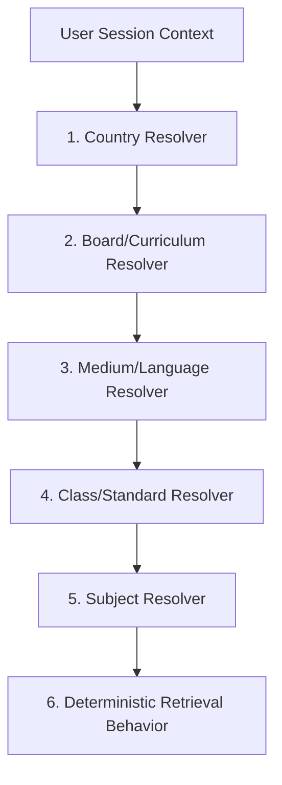
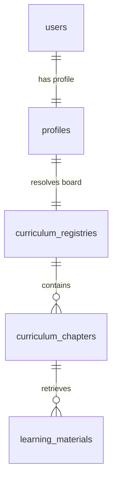

# 🏛️ Curriculum Resolution Layer: Routing Architecture
**Document Version:** 1.0.0 (TANTRA Standard compliant)  
**Author:** Soham Kotkar — Zero-Friction Compliance Sprint Lead  

---

## 1. Architectural Overview

The **Curriculum Resolution Layer** is the core routing engine of Gurukul. It translates a user's contextual data (geography, active enrollment, language preferences) into a deterministic set of educational materials. This prevents curriculum mismatches and guarantees that teachers, students, and reviewers are served content that is 100% aligned with their designated board and standard.

### The Canonical Routing Flow


---

## 2. Resolver Specifications

### A. Country Resolver
*   **Role:** Identifies the national scope.
*   **Default:** `IN` (India).
*   **Behavior:** Determines which primary school boards are available.

### B. Board/Curriculum Resolver
*   **Role:** Resolves standard educational frameworks.
*   **Balbharati:** महाराष्ट्र राज्य पाठ्यपुस्तक निर्मिती व अभ्यासक्रम संशोधन मंडळ (Maharashtra State Board - Offline print-textbook mapped).
*   **e-Balbharati:** The digital and interactive web/PDF-based curriculum of Maharashtra (incorporating media files and online quizzes).
*   **SCERT:** State Council of Educational Research and Training (State-specific teacher-training and localized textbook overlays).
*   **NCERT:** National Council of Educational Research and Training (CBSE / central national syllabus mapping).
*   **Extensibility:** Gated via dynamic registry configurations to allow additions like *Gujarat State Board (GSBST)* or *Uttar Pradesh Board (UPMSP)*.

### C. Medium Resolver
*   **Role:** Restricts textbook lookups to the chosen language medium.
*   **Supported:** `mr` (Marathi), `en` (English), `hi` (Hindi).
*   **Fallback:** If a specific subject is missing a Marathi translation, the system falls back to `en` (English) while issuing a silent Pravah warnings telemetry payload.

### D. Class/Standard Resolver
*   **Role:** Maps to standard academic standards.
*   **Terminology Mapping:** Internally refers to standard class notations (`Class 1` to `Class 12`). Converts `Grade X` or `Standard 10` inputs dynamically depending on the active board nomenclature.

### E. Subject Resolver
*   **Role:** Maps specific subjects (e.g., Mathematics, Science, Civics) to standard national/state IDs.

---

## 3. Database & Entity Representation

The resolution layer relies on standard SQLAlchemy objects defined in `backend/app/models/all_models.py` (specifically `User` and `Profile`) but introduces a new schema mapping configuration stored in `c:\Users\pc45\Desktop\Gurukul\backend\app\models\curriculum_models.py`.



### Dynamic Database Schema Specification
```python
# Proposed Schema for Database Hardening
class CurriculumRegistry(Base):
    __tablename__ = "curriculum_registries"
    
    id = Column(String, primary_key=True, default=generate_uuid)
    country_code = Column(String, default="IN", nullable=False) # e.g., "IN"
    board_name = Column(String, nullable=False) # e.g., "BALBHARATI", "NCERT"
    medium = Column(String, nullable=False) # e.g., "mr", "en", "hi"
    class_standard = Column(Integer, nullable=False) # e.g., 10
    subject = Column(String, nullable=False) # e.g., "science_and_technology_1"
    textbook_code = Column(String, nullable=True) # e.g., "MSB-S10-MR"
    schema_version = Column(String, default="1.0.0")
    created_at = Column(DateTime, server_default=func.now())

class CurriculumChapter(Base):
    __tablename__ = "curriculum_chapters"
    
    id = Column(String, primary_key=True, default=generate_uuid)
    registry_id = Column(String, ForeignKey("curriculum_registries.id"), nullable=False)
    chapter_number = Column(Integer, nullable=False)
    chapter_title = Column(String, nullable=False)
    keywords = Column(JSON, default=[]) # For semantic indexing
    textbook_pages = Column(String, nullable=True) # e.g., "24-45"
```

---

## 4. REST API Specification

A dedicated set of REST APIs provides zero-friction endpoints for resolving student material.

### 🌐 1. Resolve Active Curriculum Context
*   **Endpoint:** `GET /api/v1/compliance/curriculum/resolve`
*   **Auth:** Mandatory JWT (Bearer Token) or guest mode fallback
*   **Request Query Parameters:**
    ```text
    country=IN
    board=BALBHARATI
    medium=mr
    class_std=10
    ```
*   **Response Payload (`200 OK`):**
    ```json
    {
      "status": "success",
      "resolution": {
        "resolved_board": "BALBHARATI",
        "medium": "mr",
        "class_standard": 10,
        "textbook_code": "MSB-S10-MR",
        "canonical_name": "Maharashtra State Board Class 10 (Marathi Medium)",
        "governed_by": "Balbharati Publication Bureau"
      },
      "routing_determinism": {
        "schema_version": "1.0.0",
        "cache_hit": false,
        "hash": "08f3e25b1c97a824eefb"
      }
    }
    ```

### 🌐 2. Get Chapters & Content Alignment
*   **Endpoint:** `GET /api/v1/compliance/curriculum/chapters`
*   **Request Query Parameters:**
    ```text
    registry_id=cur-registry-8821a
    ```
*   **Response Payload (`200 OK`):**
    ```json
    {
      "registry_id": "cur-registry-8821a",
      "subject": "science_and_technology_1",
      "chapters": [
        {
          "chapter_number": 1,
          "title": "Gravitation (गुरुत्वाकर्षण)",
          "pages": "1-15",
          "topics_covered": ["Kepler's Laws", "Acceleration due to Gravity", "Free Fall", "Escape Velocity"]
        },
        {
          "chapter_number": 2,
          "title": "Periodic Classification of Elements (मूलद्रव्यांचे आवर्ती वर्गीकरण)",
          "pages": "16-33",
          "topics_covered": ["Dobereiner's Triads", "Newlands' Octaves", "Mendeleev's Periodic Table"]
        }
      ]
    }
    ```

---

## 5. Extensible State Board Registration (Blueprint)

Adding a new state board requires **zero code changes**. The system is built on a dynamic configuration router. To onboard the **UP Board** or **Gujarat Board**, the administrator simply registers the metadata payload into `curriculum_registries`.

```json
{
  "action": "ONBOARD_BOARD",
  "payload": {
    "country_code": "IN",
    "board_name": "UPMSP",
    "medium": "hi",
    "class_standard": 9,
    "subject": "social_science",
    "textbook_code": "UP-SS9-HI"
  }
}
```

The router dynamically updates its registry routes. When a student profile updates to `UPMSP` and `hi`, the router automatically points chapter retrievals to UPMSP chapter repositories instead of fallbacks.
