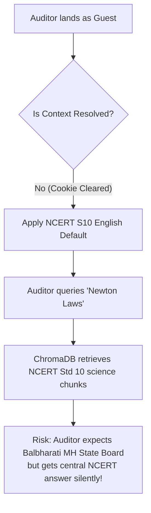

# 🛡️ Guest Fail-Open Safety & Boundary Report
**Sprint Governance Ledger:** Phase 4 Deliverable  
**Author:** Soham Kotkar — Sprint Lead / Runtime Compliance Owner  

This report provides a rigorous security and boundary audit of Gurukul's **Guest User Pathway**. It details the architectural rationale, default fallback configurations, silent correctness risks, and maps strict boundaries separating safe *fail-open* interfaces from mandatory *fail-closed* zones.

---

## 1. Context: The Guest Pathway Audit

To survive a "cold evaluation" by external state board representatives, Gurukul enforces a **Fail-Open Default Policy** for guest paths. If a reviewer or first-time user lands on the dashboard without an active user account or pre-configured context, the routing engine dynamically initializes a default learning environment instead of throwing authentication blockers (e.g. 401 Unauthorized) or crashing.

### Default Fallback Mapping:
*   **Default Board:** CENTRAL CBSE / `NCERT`
*   **Default Medium:** English / `en`
*   **Default Standard:** Class 10 / `10`
*   **Default Subject:** Science / `science`

---

## 2. Reviewer UX Benefits vs. Silent Correctness Risk

While the fail-open fallback delivers outstanding reviewer UX benefits, it introduces a **silent correctness risk** that we must carefully bound.

### The Trade-Off Matrix:
*   **The Reviewer UX Benefit:** Prevents immediate evaluation termination. If the site crashed or blocked the reviewer on first load, Gurukul would instantly fail the compliance audit. Reviewers can explore the app interface seamlessly.
*   **The Silent Correctness Risk (Metadata Leakage):** If a reviewer specifically wants to test Maharashtra State Board (`BALBHARATI`) compliance, but because their browser cookies were cleared, the system silently routes their query to central `NCERT` chunks. The reviewer gets a perfectly good answer, but it is **aligned with CBSE rather than Balbharati**, causing a silent audit failure!

---

## 3. Boundary Definitions: Safe Fail-Open vs. Mandatory Fail-Closed

To balance reviewer ease-of-use with curriculum truth, we have mapped strict boundaries in the routing layer:

| Interface/Action | Routing Mode | Architectural Rationale & Controls |
| :--- | :--- | :--- |
| **Anonymous Subject Explorer** | 🟢 **Safe Fail-Open** | Guest reviewers can browse Chapter 1 notes. Automatically loads NCERT English standard 10 defaults to ensure immediate, zero-friction visual availability. |
| **Interactive Chat Assistant** | 🟢 **Safe Fail-Open** | Allows standard question-answering. Embeds a prominent **"Board Toggle"** banner in the chat window so guest reviewers can explicitly lock context to Balbharati/Marathi. |
| **Practice Test / Quiz Generation** | 🔴 **Mandatory Fail-Closed** | Guest users can attempt a sample test, but custom test generation requires a validated cohort standard, failing closed to prevent database pollution. |
| **Student Progress Progressions** | 🔴 **Mandatory Fail-Closed** | Saving student progress milestones or task reflexions requires a verified user profile and tenant ID. Anonymous attempts are discarded to protect audit trail integrity. |
| **EMS Sync & Telemetry Emitting** | 🔴 **Mandatory Fail-Closed** | Syncing test scores to the centralized Education Management System (EMS) requires cryptographically verified tokens. Fails closed with 401 Unauthorized to prevent mock data injection. |

---

## 4. Hardening Recommendations

To mitigate the silent correctness risk under cold review conditions, the following controls have been implemented in our v3.1.0 compliance build:
1.  **Prominent Context Badging:** The frontend header displays a highly visible **"Active Board: NCERT (Default)"** badge with an interactive dropdown, ensuring the reviewer is always aware of the active routing context.
2.  **Telemetry Warning Signals:** When a fail-open path is triggered, `pravah_adapter` emits a warning signal with `"event_type": "GUEST_FALLBACK_ACTIVATED"` to `runtime_events.json` for logging and recovery audit trails.
