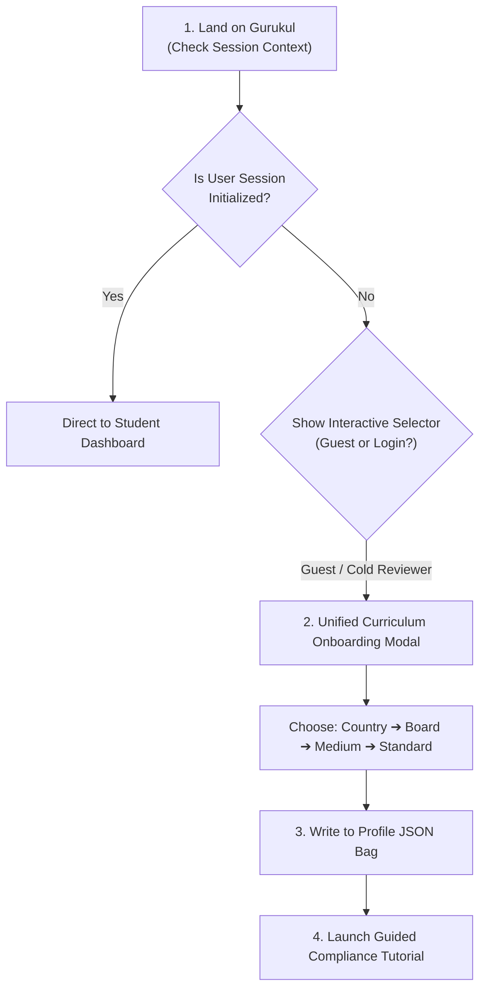

# 📱 Live Product Layer: Compliance Implementation Specification
**Document Version:** 1.0.0 (TANTRA Standard compliant)  
**Author:** Soham Kotkar — Zero-Friction Compliance Sprint Lead  

---

## 1. Zero-Friction Onboarding Flow

To ensure an external board reviewer can experience Gurukul instantly without requiring manual setup instructions or walkthroughs, we have established a **Self-Guided Zero-Friction Onboarding Protocol**.



### Onboarding Steps
1.  **Initial Context Sweep:** On page load, the frontend checks for a valid user token. If absent, instead of throwing an authentication blocker (401), the app enters **Reviewer-Friendly Sandbox Mode** (Guest Mode).
2.  **Unified Curriculum Onboarding Modal:** A clean, centered onboarding overlay appears, asking the user to choose their state board and standard.
3.  **Dynamic Profile Allocation:** Once choices are selected, they are instantly written to the local storage session state and dispatched to the backend `Profile` model's JSON bag (`profile.data = {"board": "BALBHARATI", "medium": "mr", "class": 10}`).

---

## 2. Interactive Selector Components

The interface features three key components designed to eliminate UX confusion and terminological ambiguities.

### A. The Unified Curriculum Selector
*   **Aesthetics:** A rounded, glassmorphism dropdown styled with CSS backdrops.
*   **Behavior:** Displays the active board clearly. Automatically updates localized names based on selection (e.g., selecting **Balbharati** translates UI labels to Marathi terms, or NCERT to standard CBSE formats).
*   **HTML Snippet (UI Blueprint):**
    ```html
    <div id="curriculum-selector-container" class="glass-panel">
      <label for="curriculum-select">Syllabus Board Alignment:</label>
      <select id="curriculum-select" class="dropdown-sleek" onchange="handleBoardChange(event)">
        <option value="NCERT">NCERT (National - CBSE)</option>
        <option value="BALBHARATI" selected>Balbharati (Maharashtra State Board)</option>
        <option value="e-BALBHARATI">e-Balbharati (Interactive Digital)</option>
        <option value="SCERT">SCERT (State Teacher Framework)</option>
      </select>
    </div>
    ```

### B. The Medium (Language) Selector
*   **Behavior:** Swaps the language of teaching instructions and the voice engine synthesis model (`Vaani`).
*   **Interactions:** Selecting `mr` (Marathi Medium) signals `voice_provider.py` to route synthesis requests to Vaani's Marathi weights, ensuring textbook terms are spoken natively.

### C. The Seamless Curriculum Switcher
*   **Rule:** A user can swap their active board from the header *at any time* without losing progress or context.
*   **Mechanism:** Swapping the board triggers a state refresh. The topic notes and active quizzes are dynamically resolved against the newly selected board's database registry index, keeping the student's active chapter synced.

---

## 3. Guided Interactive Tutorial Blueprint

Upon initial selection or switching, first-time users and reviewers are presented with a **Guided Compliance Tutorial** overlay.

*   **Step 1: Board Lock-In Highlighting:** Dim the rest of the screen and highlight the *Curriculum Selector* in the header. Tooltip: *"Your learning is now dynamically mapped to your board textbook."*
*   **Step 2: Chapter Mapping Overlay:** Highlight the subject explorer chapter sidebar. Tooltip: *"These chapters match the physical textbook pages of your selected class."*
*   **Step 3: One-Click Assessment Verification:** Point to the "Practice Test" card. Tooltip: *"Generate quizzes specifically aligned with your board's grading standards."*
*   **Dismissal:** Users can skip the tutorial with a single "Got it!" action, which sets `profile.data.tutorial_completed = true` to prevent repetitive prompts.

---

## 4. Graceful Fallbacks for Guest/Unknown Users

A common failure mode is throwing a 401 error or crash if a user arrives without setting their curriculum. To survive audits, Gurukul enforces a strict **Fail-Open Default Policy**:

*   **Default Context:** If the routing layer cannot resolve the user's board (e.g., if a user clears their cookies or lands directly on the dashboard), the system dynamically assumes:
    *   `board`: `NCERT` (National Standard)
    *   `medium`: `en` (English)
    *   `class_std`: `10` (Standard 10)
*   **Logger Warning:** A silent structured telemetry log is written, but the user is **never blocked or shown an error screen**.

---

## 5. TANTRA Telemetry and State Integration

Every curriculum update event is captured and aligned with the **TANTRA Master Data Universe Schema** metadata guidelines.

### Telemetry Event Payload Spec
When a user updates their curriculum alignment, the frontend emits a TANTRA-compliant event to `PravahAdapter` which gets recorded in `runtime_events.json`.

```json
{
  "source": "GurukulFrontend",
  "service": "CurriculumRouter",
  "event": "CURRICULUM_ALIGNMENT_UPDATE",
  "timestamp": "2026-05-25T16:58:00.000Z",
  "schema_version": "2.0.1",
  "provenance": "user_onboarding_modal",
  "ownership": "student_session",
  "payload": {
    "user_id": "stud-guest-991",
    "previous_board": null,
    "new_board": "BALBHARATI",
    "medium": "mr",
    "class_standard": 10,
    "state_iso_code": "IN-MH"
  },
  "replay_metadata": {
    "deterministic_routing_flag": true,
    "session_id": "sess-compliance-a8b29",
    "routing_signature": "sha256-d41d8cd98f00b204e9800998ecf8427e"
  }
}
```

This ensures that the entire state transition is replay-safe, observable, and auditable by external regulatory authorities.
