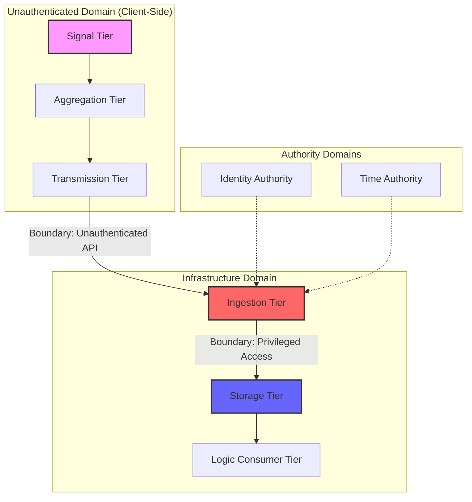

# PRANA Trust Boundary Analysis (Adversarial Expansion)

**Role:** Sovereign Red-Team Architect  
**Objective:** Expose unverified assumptions and implicit trust dependencies.  
**Tone:** Adversarial/Analytical.

## 1. Primary Trust Domains

### 1.1 Unauthenticated Domain (Client-Side)
- **Included Components:** Signal Tier, Aggregation Tier, Transmission Tier.
- **Trust Level:** ZERO. Fully under user control.
- **Exposure:** Complete logic manipulation, signal mocking, and packet suppression.
- **Implicit Dependency:** Assumes browser `localStorage` and `performance.now()` are honest sources.

### 1.2 Ingest Service Domain
- **Included Components:** Ingestion Tier (`bucket.py`).
- **Trust Level:** LOW.
- **Exposure:** Open POST endpoint.
- **Implicit Trust:** Assumes identity claims in the JSON payload are authentic without technical verification against a central authority.

### 1.3 Infrastructure Control Plane Domain
- **Trust Level:** ABSOLUTE (and unverified).
- **Assets Controlled:** Network routing, Server compute, OS environment variables.
- **Implicit Assumptions:** Assumes the cloud provider or hypervisor does not intercept raw memory or modify environment flags (e.g., `PRANA_DISABLED`).
- **Failure Impact:** If hypervisor integrity fails, every "truth" in the system is a managed hallucination.

### 1.4 Deployment / CI-CD Domain
- **Trust Level:** CRITICAL.
- **Assets Controlled:** Source code integrity, Container images, Secret injection.
- **Implicit Assumptions:** Assumes that the build pipeline is not poisoning `prana-core` during minification or injecting backdoors into `bucket_consumer`.
- **Failure Impact:** Total system compromise before a single packet is ever emitted.

### 1.5 Identity Authority Domain
- **Trust Level:** HIGH (Externalized).
- **Assets Controlled:** User-to-ID mappings, Session validity.
- **Implicit Assumptions:** Assumes the JWT issuer or Auth service is 100% available and truthful.
- **Failure Impact:** A compromised identity domain allows for mass impersonation in the PRANA ledger, making telemetry contextually meaningless.

### 1.6 Time Authority Domain
- **Trust Level:** UNCONTROLLED.
- **Assets Controlled:** `packet.timestamp`, `received_at` drift.
- **Implicit Assumptions:** Assumes the server and client clocks are synchronized and that `NTP` is not being spoofed. 
- **Failure Impact:** Poisoned time-stamping allows for replay attacks that circumvent basic interval validation or cause packets to be dropped as "too old/future".

### 1.7 Monitoring & Logging Domain
- **Trust Level:** SECONDARY (Passive).
- **Assets Controlled:** Audit trails, Error logs, System metrics.
- **Implicit Assumptions:** Assumes that the logging system is not being used as an exfiltration channel and that the monitors are not themselves being fed forged "Heartbeat healthy" signals.
- **Failure Impact:** Operational blindness; active breaches remain invisible due to alert suppression.

### 1.8 Backup & Snapshot Domain
- **Trust Level:** AT REST.
- **Assets Controlled:** DB Dumps, S3 Snapshots.
- **Implicit Assumptions:** Assumes that recovery media is immutable and that restoration processes are not manipulated to revert the system to a "privileged vulnerable state".
- **Failure Impact:** Restoration of a compromised history allows for the permanent erasure of evidence under the guise of "Recovery".

---

## 2. Textual Trust Boundary Diagram

## 3. Explicit Boundary Crossings & Safety Status

| Source Domain | Destination Domain | Unenforced Invariant | Adversarial Result |
| :--------------- | :----------------- | :--------------------- | :-------------------------- |
| **User Browser** | **Ingestion Tier** | Lack of Identity Proof | Identity Forgery (Trivial) |
| **Ingestion Tier**| **Storage Tier** | Lack of Signature Verification | History Injection (Trivial) |
| **Storage Tier** | **Recovery Media** | Lack of Integrity Proof | Evidence Erasure (Sovereign) |
| **Central Auth** | **PRANA Context** | Lack of Token Binding | Context Mimicry (Medium) |
| **NTP/System Clock**| **Packet Timing** | Lack of Monotonic Proof | Time Replay / Suppression |

---

## 4. Privilege Escalation Paths

### 4.1 Unauthenticated Entry → Global Truth Manipulation
- **Vector:** The Ingestion Tier accepts any `user_id`.
- **Escalation:** An attacker moves from a "Guest/External" state to a "System-Level Storyteller," capable of rewriting the karma history of any user without possessing their credentials.

### 4.2 Infrastructure Access → Total Invisible Compromise
- **Vector:** Access to server environment variables.
- **Escalation:** Setting `PRANA_DISABLED=true` or changing the `bucket_endpoint` to a rogue listener. The system stops reporting "Truth" entirely, while the UI continues to appear "Healthy".

---

## 5. Fundamental Fragilities

1. **Implicit Infrastructure Trust:** The system makes no effort to verify that it is running on the intended hardware or that the OS is untampered.
2. **Post-Facto Logic:** Reliability is dependent on a Transmission Tier that resides in a zero-trust environment. If the bridge is suppressed by a browser extension or proxy, PRANA is successfully blinded without server-side knowledge.
3. **Linear State Chain:** The system lacks any parallel, independent cross-check of truth. If the single path from Sensor → DB is compromised, there is no secondary "Watcher" to detect the deviation.
4. **Time Source Singularity:** By relying on standard system time without drift-verification or high-precision monotonic sources, the ledger is susceptible to "History Squeezing" (simulating 1 hour of work in 10 minutes of real time).
