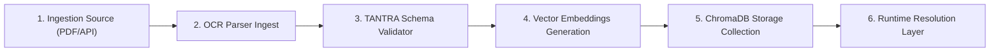

# 🌿 MDU Lineage & Provenance Discipline

**Sprint Compliance Level:** TANTRA-Hardened (Operator-Grade)  
**Verification Target:** Phase 3 Convergence Audit  
**Author:** Soham Kotkar — Sprint Lead & Compliance Owner  

This document details the metadata lineage model, cryptographic provenance schemas, and lifecycle state rules governing datasets inside the **Master Data Universe (MDU) Registry**.

---

## 1. Lineage Chain Design and Assumptions

Every piece of educational content ingested into the Gurukul RAG vector databases (ChromaDB) must be fully traceable back to its canonical source. The system represents this using a directed acyclic lineage chain.



### Core Lineage Assumptions:
- **Immutability:** Once a dataset is ingested, its historic lineage chain remains immutable. Any updates generate a new schema version.
- **Strict Isolation:** Standard and board contexts are isolated at the vector metadata collection level. Leakage indices are monitored constantly, expecting a target score of `1.0` (zero leakage).

---

## 2. Parent-Child Relationship and Navigation

Curriculum mapping maintains a hierarchically strict parent-child structure. This structure enables administrators to navigate seamlessly up or down the educational tree:

- **Parent Node:** Ingestion Board (e.g. `BALBHARATI`)
  - **Child Node:** Language Medium (e.g. `mr` - Marathi)
    - **Child Node:** Grade Standard (e.g. `10`)
      - **Child Node:** Canonical Subject (e.g. `science_and_technology_1`)
        - **Child Node:** Chapters & Textbook Code (`MSB-S10-MR`)
          - **Child Leaf:** ChromaDB Segment Chunk (`bb-mr-10-s1-c1-01`)

---

## 3. Administrative Schema Lifecycle Management

A dataset progresses through formal, operator-controlled lifecycle stages to enforce high curriculum quality:

| Lifecycle Stage | Active Operations | Allowed Transitions |
| :--- | :--- | :--- |
| **DRAFT** | Ingestion, validation testing, schema matching | `ACTIVE` |
| **ACTIVE** | Live RAG query resolution, student session mapping | `DEPRECATED`, `ROLLBACK_VERIFIED` |
| **DEPRECATED** | Preserved for historic audit trail; blocked from runtime resolution | `ACTIVE` (re-verification), `ARCHIVED` |
| **ROLLBACK_VERIFIED** | Reverted to a known stable historic version under operator signature | `ACTIVE` |

Operators transition schemas by calling `/api/v1/mdu/lifecycle/action` under their unique cryptographic operator signature.

---

## 4. Cryptographic Ingestion Provenance Semantics

To prevent unauthorized, silent modifications to textbook chunks, every ingestion and modification process generates a git-style provenance event. 

### Ingress Event Hash Formula:
$$Hash = SHA256(Operator + ActionDescription + TargetDatasetId + Timestamp)$$

### Example Provenance Schema:
```json
{
  "timestamp": "2026-06-01T09:24:43.125Z",
  "operator": "Soham Kotkar (Lead)",
  "action": "Executed lifecycle change: ACTIVATE",
  "dataset": "MSB-S10-MR",
  "hash": "a4d3f82b1c97a824eefb7c8d92e408f3e25b1c97a824eefb7c8d92e408f3e25b"
}
```
All provenance records are appended in a linear chain and displayed transparently in the Operator Diagnostic Terminal.
