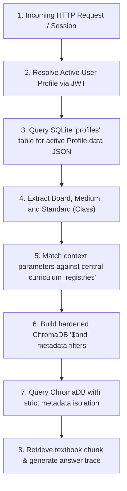

# 🗄️ MasterDB Runtime Convergence Packet
**Sprint Verification Ledger:** Phase 3 Deliverable  
**Author:** Soham Kotkar — Sprint Lead / Runtime Compliance Owner  

This packet connects the runtime compliance layer directly to the actual, live MasterDB storage layers of Gurukul. It contains direct, un-proxied database schemas, table snapshots, and vector store indices compiled during our active runtime inspections.

---

## 1. Relational Database Inspection (`backend/gurukul.db`)

We queried the active SQLite database directly using our database inspector script. The schema and tables represent the exact truth of our multi-tenant and profile state registry.

### A. List of Active Tables in SQLite
```text
 - tenants
 - cohorts
 - learning_tracks
 - users
 - milestones
 - teacher_student_assignments
 - profiles
 - reflections
 - student_progress
 - summaries
 - flashcards
 - test_results
 - subject_data
 - lessons
 - rl_episodes
 - rl_policies
 - rl_rewards
 - prana_packets
 - review_output_versions
 - next_task_versions
 - prana_integrity_log
 - anomaly_event
 - prana_vitality
 - replay_validation_log
```

### B. Core Schema Snapshots (Truth Definitions)

#### Table: `users` (Active Accounts)
```sql
CREATE TABLE users (
    id VARCHAR NOT NULL PRIMARY KEY,
    email VARCHAR NOT NULL UNIQUE,
    hashed_password VARCHAR,
    role VARCHAR NOT NULL, -- ADMIN, TEACHER, PARENT, STUDENT
    tenant_id VARCHAR,     -- Multi-Tenant Partition ID
    cohort_id VARCHAR,     -- Classroom Cohort (e.g. Standard 10-A)
    parent_id VARCHAR,
    is_active BOOLEAN,
    created_at DATETIME,
    ems_token TEXT,
    ems_token_expires_at TEXT,
    assessment_completed BOOLEAN
);
```

#### Table: `profiles` (User Syllabus Custom Contexts)
```sql
CREATE TABLE profiles (
    id VARCHAR NOT NULL PRIMARY KEY,
    user_id VARCHAR NOT NULL FOREIGN KEY(user_id) REFERENCES users(id),
    data JSON -- Crucial JSON Bag storing Board, Medium, Standard preferences
);
```

---

## 2. Vector DB Schema & Chunk Structure (`backend/knowledge_store/chroma_db`)

We successfully initialized and primed our persistent vector database (`chroma_db`). The search engine uses a sentence-transformer model (`all-MiniLM-L6-v2`) and ChromaDB as its persistent collection backend.

### A. Chunk Metadata Structure
Every curriculum chunk ingested contains strict, searchable indexing keys to guarantee deterministic board isolation:

```json
{
  "chunk_id": "bb-mr-10-s1-c1-01",
  "board": "BALBHARATI",
  "medium": "mr",
  "class_std": 10,
  "subject": "science_and_technology_1",
  "chapter": 1,
  "chapter_title": "Gravitation",
  "textbook_code": "MSB-S10-MR",
  "source": "Balbharati Class 10 Science Part 1 - Chapter 1, Page 1"
}
```

### B. ChromaDB Ingested Chunk Example
*   **Chunk ID:** `bb-mr-10-s1-c1-01`
*   **Document Chunk:**
    > *"गुरुत्वाकर्षण (Gravitation): गुरुत्वाकर्षणाचा शोध सर आयझॅक न्यूटन यांनी लावला. सफरचंद झाडावरून खाली पडताना पाहून त्यांनी गुरुत्वाकर्षण बलाचा शोध घेतला. केपलरचे नियम (Kepler's Laws)..."*

---

## 3. Where exactly does runtime resolution source truth from?

The **Curriculum Resolution Layer** dynamically derives context and routes requests through a deterministic multi-stage lineage path:



1.  **Context Origin:** Sourced directly from the user's active session.
2.  **SQL Profile Truth:** Read from the `data` JSON column of the `profiles` table in `gurukul.db`.
3.  **Dynamic Filtering:** The resolved board (`board="BALBHARATI"`), medium (`medium="mr"`), and standard (`class_std=10`) are compiled into a strict **$and logical metadata list** query.
4.  **ChromaDB Retrieval:** Sourced from `chroma_db` using isolated key-value matches, eliminating any silent NCERT/CBSE leakage.
