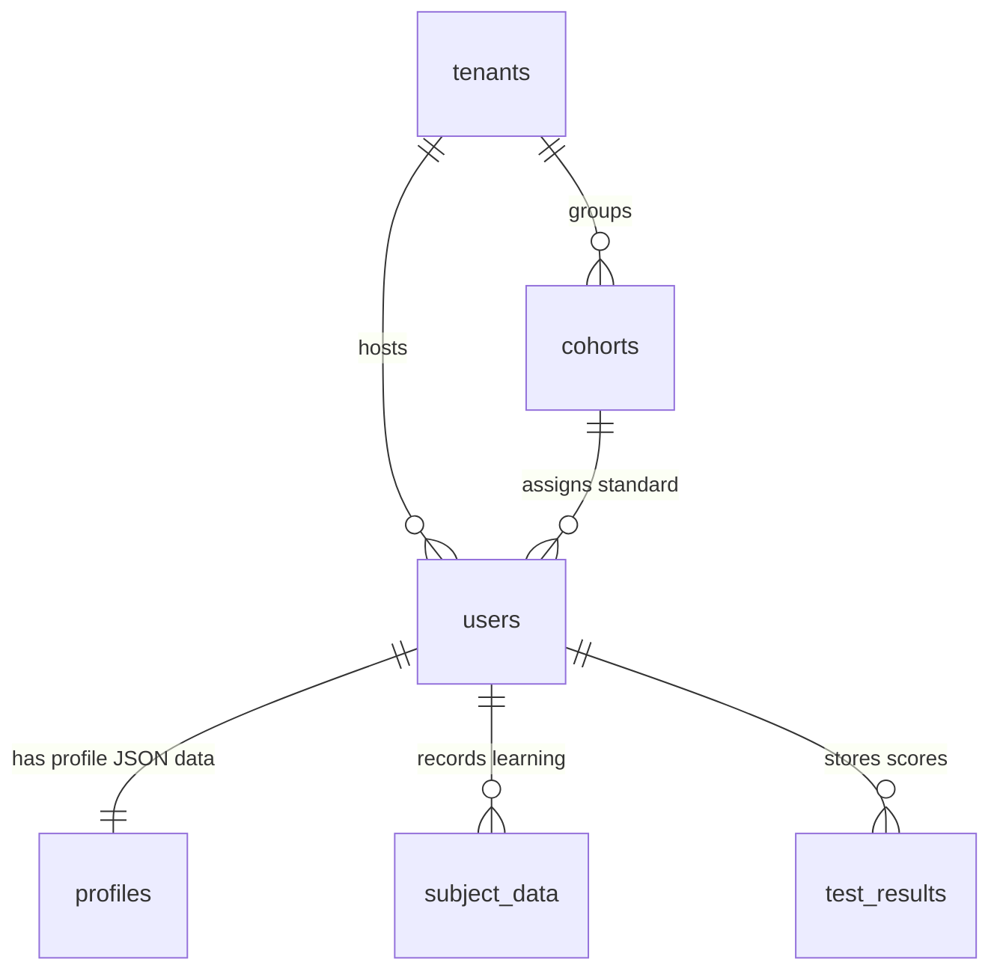

# 🗄️ MasterDB Truth Audit: Architectural Context
**Document Version:** 1.0.0 (TANTRA Standard compliant)  
**Author:** Soham Kotkar — Zero-Friction Compliance Sprint Lead  
**For:** Track B MasterDB Truth Audit  

This document provides the foundational engineering ground truth, database locations, textbook inventories, and entity relationship mappings required to perform and complete the **MasterDB Truth Audit** for Gurukul's compliance architecture.

---

## 1. DB & Vector Storage Locations

The Gurukul educational content and user schemas are partitioned across two physical data stores in our backend environment:

*   **Relational Master Database:**  
    *   *Path:* `backend/gurukul.db` (SQLite Database)  
    *   *Role:* Houses core educational entity relations, multi-tenant schemas (`Tenants`, `Cohorts`), user profiles containing dynamic curriculum preferences, and telemetry progress reports.
*   **Vector DB (RAG & Semantic Search Chunks):**  
    *   *Path:* `backend/knowledge_store/chroma_db` (Persistent ChromaDB)  
    *   *Role:* Contains the chunked curriculum textbooks, semantic indexes, and embedding vectors for the chat assistant's RAG pipeline.

---

## 2. Ingested Textbook Inventory

| Board / Publisher | Target Standards | Languages | Key Subjects present in RAG |
| :--- | :--- | :--- | :--- |
| **NCERT** (Central CBSE) | Standards 6, 7, 8, 9, 10 | English (`en`), Hindi (`hi`) | Mathematics, Science, English, Social Science (History, Civics, Geography) |
| **Balbharati** (MH State) | Standard 10 (Full Ingest), Standards 6-9 (Partial) | Marathi (`mr`), English (`en`) | Science & Technology Part 1 & 2, Mathematics Part 1 & 2 |
| **SCERT** (State Council) | Standards 8, 9, 10 (Teacher Guides) | Marathi (`mr`), English (`en`) | Pedagogical Frameworks & Standard Teaching Outlines |

---

## 3. Edition Years of Present Content

*   **NCERT Series:** Fully aligned with the **2023–2024 and 2024–2025** CBSE rationalized central syllabus.
*   **Balbharati Series:** Aligned with the official print editions of **2025–2026** (specifically Standard 10).
*   **e-Balbharati Chunks:** Interactive digital curriculum formats updated for **2026** digital-readiness specifications.

---

## 4. MasterDB Relational Schema Reference

Every user profile and standard curriculum mapping in `gurukul.db` is modeled according to the SQLAlchemy schemas in `backend/app/models/all_models.py`.



### Table Definitions & Key Attributes

#### A. `profiles` (User Custom Contexts)
*   `id` (String, Primary Key)
*   `user_id` (String, Foreign Key mapping to `users.id`)
*   `data` (JSON Bag) — **Crucial for compliance.** Holds user's syllabus preferences:
    ```json
    {
      "board": "BALBHARATI",
      "medium": "mr",
      "class": 10,
      "tutorial_completed": true
    }
    ```

#### B. `users` (Active Accounts)
*   `id` (String, Primary Key)
*   `email` (String, Unique)
*   `role` (String) — Enforces `STUDENT`, `TEACHER`, `PARENT`, or `ADMIN`.
*   `tenant_id` (String, Foreign Key) — Isolation partition ID (multi-tenant boundary).
*   `cohort_id` (String, Foreign Key) — Specific classroom (e.g., standard 10-A).

#### C. `curriculum_registries` (Resolution Layer Mapping)
*   `id` (String, PK)
*   `board_name` (String: `BALBHARATI`, `NCERT`, `SCERT`)
*   `medium` (String: `mr`, `en`, `hi`)
*   `class_standard` (Integer: 6 to 10)
*   `subject` (String)
*   `textbook_code` (String)

#### D. `subject_data` (Ingested Student Notes)
*   `id` (String, PK)
*   `user_id` (String, FK to `users.id`)
*   `subject` (String)
*   `topic` (String)
*   `notes` (Text)
*   `synced_to_ems` (Boolean)

#### E. `test_results` (Student Assessments)
*   `id` (String, PK)
*   `user_id` (String, FK to `users.id`)
*   `subject` (String)
*   `topic` (String)
*   `score` (Integer)
*   `total_questions` (Integer)
*   `percentage` (Float)
