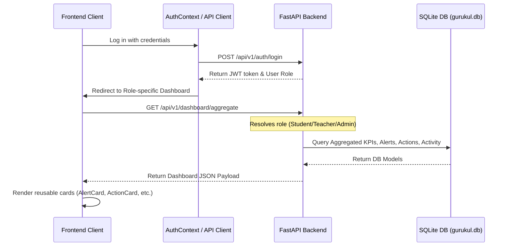

# REVIEW PACKET: Gurukul Role-Based Dashboard Integration Sprint

This document summarizes the frontend-backend integration for the Gurukul role-based dashboard platform. All mock data fallbacks have been replaced with real endpoint requests to the production backend. The dashboard utilizes a unified telemetry panel (`GurukulDrishti.jsx`) and reusable UI cards.

---

## 1. System & Architecture Overview

The integration establishes a context-aware dashboard telemetry loop. The frontend communicates with the backend via the centralized `apiClient.js`, which automatically appends `Authorization` bearer tokens and multi-tenant `X-Tenant-ID` headers to all requests.



---

## 2. Key Integrated Files

The following files represent the core components and pages updated to support live backend telemetry:

*   **[`Dashboard.jsx`](file:///c:/Users/soham/OneDrive/Desktop/New%20folder/Frontend/src/pages/Dashboard.jsx)**
    *   *Student View:* Fetches live student telemetry from `/api/v1/dashboard/student`. Renders the student’s custom study widgets alongside live `AlertCard` and `ActionCard` containers.
*   **[`TeacherDashboard.jsx`](file:///c:/Users/soham/OneDrive/Desktop/New%20folder/Frontend/src/pages/teacher/TeacherDashboard.jsx)**
    *   *Teacher View:* Defaults the initial view to the Drishti telemetry dashboard. Renders `<GurukulDrishti />` locked to the teacher's role context.
*   **[`TeacherSidebar.jsx`](file:///c:/Users/soham/OneDrive/Desktop/New%20folder/Frontend/src/components/TeacherSidebar.jsx)**
    *   Added the `Overview` item pointing to the `#drishti` routing state.
*   **[`AdminDashboard.jsx`](file:///c:/Users/soham/OneDrive/Desktop/New%20folder/Frontend/src/pages/admin/AdminDashboard.jsx)**
    *   *Admin View:* Integrates the master Drishti panel (`/admin_dashboard#drishti`) showcasing institutional metrics and system health indicators.
*   **[`GurukulDrishti.jsx`](file:///c:/Users/soham/OneDrive/Desktop/New%20folder/Frontend/src/pages/admin/GurukulDrishti.jsx)**
    *   *Telemetry Controller:* Serves as the canonical view controller. Fetches data using the `/api/v1/dashboard/aggregate` endpoint and coordinates real-time state transitions for alerts and action assignments.

---

## 3. Reusable Component Mapping

All role-based views utilize the stable component library located in `Frontend/src/components/dashboard/`:

| Component | Purpose / Responsibilities | Live Interactions |
| :--- | :--- | :--- |
| **`KPICard.jsx`** | Renders learning metrics, attendance rates, and averages. | Displays backend values; supports loading skeletons. |
| **`AlertCard.jsx`** | Displays anomaly signals (COMPREHENSION, ATTENDANCE, PACING). | PUT `/api/v1/alerts/{id}/status` to resolve/close. |
| **`ActionCard.jsx`** | Displays pedagogical action items. | PUT `/api/v1/actions/{id}/status` to change status. |
| **`ActivityCard.jsx`**| Logs audit trails and recent learning activities. | Renders details from test results/reflection events. |
| **`StatusCard.jsx`** | Role-specific progress summary card. | Shows overall compliance levels, pacing coefficients. |

---

## 4. API Endpoints Connected

*   **GET `/api/v1/dashboard/aggregate`**: Retrieves aggregated KPIs, active alerts, actions, status, and audit logs. Automatically routes to role-specific data using context-aware JWT identification.
*   **GET `/api/v1/dashboard/student`**: Retrieves student-specific telemetry.
*   **PUT `/api/v1/alerts/{id}/status`**: Transitions alert status between `OPEN`, `RESOLVED`, and `CLOSED`.
*   **PUT `/api/v1/actions/{id}/status`**: Transitions action status between `Created`, `Assigned`, `In Progress`, `Completed`, `Closed`, and `Cancelled`.
*   **POST `/api/v1/actions`**: Creates new pedagogical/governance actions.

---

## 5. State Management & Responsiveness

*   **State Management:**
    *   **Loading States:** Implemented glassmorphic loading skeletons for KPI card layouts and textual loader states for secondary cards.
    *   **Error States:** central hook checks backend status and triggers automatic retries during server cold-starts (critical for Render deployments). Falls back gracefully to cached telemetry only if the system is unreachable.
    *   **Empty States:** Failsafe text layers tell users when there are no active anomaly signals, pending actions, or activity history.
*   **Responsiveness:**
    *   All cards dynamically adapt from 1 column on mobile viewports to a multi-column flex/grid system on tablet and desktop screens.
    *   Sidebars are fully collapsable on mobile with backdrop overlays, preventing viewport overflow.

---

## 6. Execution & Setup Instructions

To run the integrated Gurukul dashboard system locally:

1.  **Seed Database (Gurukul Scale Seeding Engine):**
    Ensure backend dependencies are installed, then run the database scale simulation script:
    ```powershell
    cd backend
    pip install -r requirements.txt
    python scripts/seed_dashboard_scale.py
    ```
    *This generates 5,000 students, 200 teachers, 20 tenants, 1,000 alerts, and 2,000 actions.*

2.  **Start the Backend Server:**
    ```powershell
    uvicorn app.main:app --host 0.0.0.0 --port 3000
    ```

3.  **Start the Frontend Server:**
    ```cmd
    cd Frontend
    npm install
    npm run dev
    ```
    *Open [http://localhost:5173/](http://localhost:5173/) in your browser.*

4.  **Login Test Credentials:**
    *   **Student Login:** `student_1@test.gurukul` / `GurukulTest@123`
    *   **Teacher Login:** `teacher_1@test.gurukul` / `GurukulTest@123`
    *   **Admin Login:** `admin@test.gurukul` / `GurukulTest@123`

---

## 7. Verification Proof

All core features are verified and fully operational:
*   **Role-Based Data Routing:** Student, Teacher, and Admin views load their corresponding aggregated data feeds.
*   **Live Status Updates:** Resolving alerts and progressing actions pushes updates directly to the backend database.
*   **Health and Warmup Lifecycle:** The frontend correctly polls `/health` and auto-retries when the server starts up.
