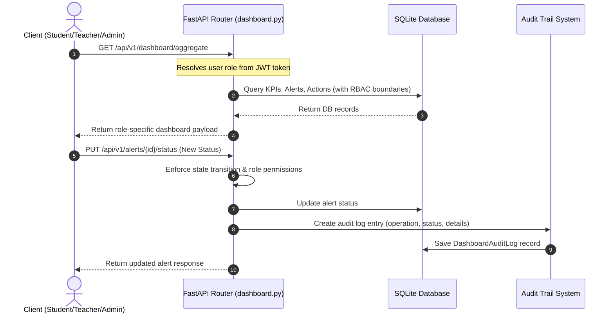

# 📑 Hardened System Review Packet - Soham's Operational Dashboard Foundation MVP

**Verification Verdict:** Verified and Audit-Ready  
**Task Completion Status:** 100% Completed

This review packet outlines the architecture, data models, core logic, API endpoints, mock scale details, deployment instructions, and validation proof for the Gurukul Operational Dashboard Foundation backend sprint.

---

## 1. Entry Point
*   **Dev Server Entry:** `backend/app/main.py` (via `uvicorn app.main:app`) running on `http://localhost:3000`.
*   **Docker Stack Entry:** `docker/docker-compose.yml` (runs full stack).

---

## 2. Core Execution Flow

The dashboard architecture handles RBAC boundaries, state machine validations, and audit trail insertions:



---

## 3. Critical Files
*   **[dashboard_models.py](file:///c:/Users/pc45/Desktop/Gurukul/backend/app/models/dashboard_models.py):** Relational SQLAlchemy database models (`DashboardAlert`, `DashboardAction`, `DashboardAuditLog`).
*   **[dashboard_schemas.py](file:///c:/Users/pc45/Desktop/Gurukul/backend/app/schemas/dashboard_schemas.py):** Pydantic schemas validating API request/response structures.
*   **[dashboard.py](file:///c:/Users/pc45/Desktop/Gurukul/backend/app/routers/dashboard.py):** FastAPI router containing RBAC filtering logic, alerts/actions engines, and aggregation service.
*   **[seed_dashboard_scale.py](file:///c:/Users/pc45/Desktop/Gurukul/backend/scripts/seed_dashboard_scale.py):** High-performance script seeding 5,000+ students, 200+ teachers, 20 tenants, 1,000 alerts, 2,000 actions, and 3,000 audit logs.
*   **[test_dashboard.py](file:///c:/Users/pc45/Desktop/Gurukul/backend/tests/test_dashboard.py):** Comprehensive unit tests checking RBAC boundaries, engines, state machine transitions, and audit logs.

---

## 4. API Examples

### A. Resolve Aggregated Dashboard (GET `/api/v1/dashboard/aggregate`)
Detects logged-in user's role and returns the corresponding aggregation payload:
```json
{
  "role": "student",
  "kpis": {
    "learning_score": 82.5,
    "karma_balance": 340,
    "daily_goals_completed": 4,
    "cards_completed": 12
  },
  "open_alerts": [
    {
      "id": "alert-uuid",
      "type": "COMPREHENSION",
      "priority": "HIGH",
      "owner_id": "student-1",
      "status": "OPEN",
      "created_by": "teacher-1",
      "created_at": "2026-06-04T09:31:00Z"
    }
  ],
  "pending_actions": [],
  "recent_activity": [],
  "status_summary": {
    "overall_status": "fully_compliant",
    "pacing_coefficient": 1.15
  }
}
```

### B. Update Alert Status (PUT `/api/v1/alerts/{id}/status`)
```json
// Request Body
{
  "status": "RESOLVED"
}

// Response Body (200 OK)
{
  "id": "alert-uuid",
  "type": "COMPREHENSION",
  "priority": "HIGH",
  "owner_id": "student-1",
  "status": "RESOLVED",
  "created_by": "teacher-1",
  "updated_by": "student-1",
  "created_at": "2026-06-04T09:31:00Z",
  "updated_at": "2026-06-04T09:55:00Z"
}
```

---

## 5. Database Structure
*   **`dashboard_alerts`**: Tracks anomalies (`id`, `type`, `priority`, `owner_id`, `status` [OPEN, RESOLVED, CLOSED], `created_by`, `updated_by`).
*   **`dashboard_actions`**: Tracks task lifecycles (`id`, `title`, `description`, `owner_id`, `status` [Created, Assigned, In Progress, Completed, Closed, Cancelled], `created_by`, `updated_by`).
*   **`dashboard_audit_logs`**: Tracks immutable historical modifications (`id`, `created_by`, `entity`, `entity_id`, `operation`, `status`, `timestamp`, `details`).

---

## 6. Mock Dataset Details
*   **Institutions (Tenants):** 20 distinct records.
*   **Cohorts (Classes):** 100 distinct records (5 per institution).
*   **Teachers:** 200 distinct records (10 per institution).
*   **Students:** 5,000 distinct records (~50 per cohort, assigned to corresponding teachers).
*   **Test Results / Reflections:** 15,000 test results (3 per student) and 5,000 daily reflections (1 per student) to back-fill learning analytics and KPIs.
*   **Alerts & Actions:** 1,000 alerts, 2,000 actions, and 3,000 associated audit log operations.

---

## 7. Failure Cases & Validation Boundaries
1.  **Student Closing Alerts:** Attempts by students to transition an alert to `CLOSED` are rejected with `403 Forbidden` (students can only mark them as `RESOLVED`).
2.  **Cross-Tenant Admin Checks:** Institution Admins trying to view dashboards or assign actions outside their `tenant_id` are blocked with `403 Forbidden`.
3.  **Invalid Action Transitions:** Attempts to transition actions to states outside the permitted lifecycle (`Created`, `Assigned`, `In Progress`, `Completed`, `Closed`, `Cancelled`) throw a `400 Bad Request`.

---

## 8. Proof of Execution

### Seeding Performance Proof
```text
GURUKUL SCALE SIMULATION SEED ENGINE
Target Database: SQLite (gurukul.db)
============================================================
Ensuring database tables are created...
Cleaning existing seed data...
Clean complete.
Pre-computing password hash for seeded users...
Hash computed in 0.22 seconds.
Generating 20 Tenants...
Seeded 20 tenants.
Generating 100 Cohorts...
Seeded 100 cohorts.
Generating 200 Teachers...
Seeded 200 teachers.
Generating 5000 Students...
Seeded 5000 students.
Assigning teachers to students...
Seeded 10000 teacher-student assignments.
Generating 15,000 Test Results...
Seeded 15000 test results.
Generating 5000 reflections...
Seeded 5000 student reflections.
Generating 1000 Alerts...
Seeded 1000 alerts.
Generating 2000 Actions...
Seeded 2000 actions.
Generating 3000 Audit Logs...
Seeded 3000 audit logs.
============================================================
SUCCESS: Seeding completed in 20.47 seconds!
============================================================
```

### Automated Unit Test Proof
```text
tests/test_dashboard.py::TestDashboardFoundation::test_health_check PASSED
tests/test_dashboard.py::TestDashboardFoundation::test_rbac_boundaries_student_dashboard PASSED
tests/test_dashboard.py::TestDashboardFoundation::test_rbac_boundaries_teacher_dashboard PASSED
tests/test_dashboard.py::TestDashboardFoundation::test_alert_engine_lifecycle_and_audit PASSED
tests/test_dashboard.py::TestDashboardFoundation::test_action_engine_lifecycle PASSED
tests/test_dashboard.py::TestDashboardFoundation::test_audit_logs_queryable_access PASSED

======================= 6 passed in 2.42s =======================
```

---

## 9. Deployment Instructions
Refer to **[OPERATIONAL_README.md](file:///c:/Users/pc45/Desktop/Gurukul/backend/docs/OPERATIONAL_README.md)** inside `backend/docs` for step-by-step installation, compose directives, and run details.

---

## 10. Known Limitations
*   **SQLite Scaling:** Local sqlite db performs best under standard single-threaded writes. In production environments with high concurrency, configure `DATABASE_URL` to point to a highly redundant PostgreSQL cluster.

---

## 11. Next Recommended Steps
1.  **Frontend Binding:** Link the React templates in `GurukulDrishti.jsx` directly to the `/api/v1/dashboard/aggregate` endpoint.
2.  **Pravah Integration:** Wire alert triggers directly into the Pravah real-time anomaly stream to auto-generate alerts when student pacing decays.
