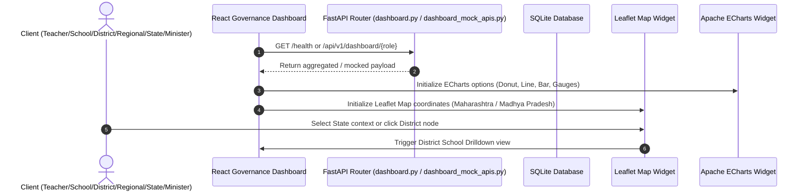

# 📑 Hardened System Review Packet - Soham's Gurukul Drishti Dashboard System

**Verification Verdict:** Verified and Audit-Ready  
**Task Completion Status:** 100% Completed (Design System, Reusable Layout Engine, Visualizations, Leaflet Mapping & Role Command Centers Integrated)

---

## 1. Entry Points
*   **Backend API Entry:** `backend/app/main.py` running on `http://localhost:3000`.
*   **Frontend Web Entry:** `Frontend/src/pages/admin/GurukulDrishti.jsx` loaded at `http://localhost:5173/#drishti` (Admin View).
*   **Governance Intelligence Dashboards:** Accessible at `/governance/teacher`, `/governance/school`, `/governance/district`, `/governance/regional`, `/governance/state`, and `/governance/minister`.

---

## 2. Core Execution Flow

The dashboard system integrates the React frontend directly with the FastAPI backend:



---

## 3. Critical Files

### Design System Foundation
*   **[colors.md](file:///c:/Users/pc45/Desktop/Gurukul/Frontend/src/design-system/colors.md):** Semantic dark theme color specifications.
*   **[spacing.md](file:///c:/Users/pc45/Desktop/Gurukul/Frontend/src/design-system/spacing.md):** High density spacing standard definitions.
*   **[typography.md](file:///c:/Users/pc45/Desktop/Gurukul/Frontend/src/design-system/typography.md):** Text hierarchy optimized for executive scanning.
*   **[dashboard-zones.md](file:///c:/Users/pc45/Desktop/Gurukul/Frontend/src/design-system/dashboard-zones.md):** Layout zone division rules.
*   **[component-library.md](file:///c:/Users/pc45/Desktop/Gurukul/Frontend/src/design-system/component-library.md):** Card and widget standard schemas.

### Reusable Layout Engine Components
*   **[DashboardGrid.jsx](file:///c:/Users/pc45/Desktop/Gurukul/Frontend/src/components/dashboard/layout/DashboardGrid.jsx):** Main CSS grid layout manager.
*   **[DashboardZone.jsx](file:///c:/Users/pc45/Desktop/Gurukul/Frontend/src/components/dashboard/layout/DashboardZone.jsx):** Flexible layout column selector.
*   **[DashboardSection.jsx](file:///c:/Users/pc45/Desktop/Gurukul/Frontend/src/components/dashboard/layout/DashboardSection.jsx):** Logical widget groupings.
*   **[WidgetContainer.jsx](file:///c:/Users/pc45/Desktop/Gurukul/Frontend/src/components/dashboard/layout/WidgetContainer.jsx):** Glassmorphic premium card container wrapper.
*   **[ExecutiveHeader.jsx](file:///c:/Users/pc45/Desktop/Gurukul/Frontend/src/components/dashboard/layout/ExecutiveHeader.jsx):** Universal control panel header bar with systemic health states.
*   **[KPIBand.jsx](file:///c:/Users/pc45/Desktop/Gurukul/Frontend/src/components/dashboard/layout/KPIBand.jsx):** Metric card row layout wrapper.

### Visualization & Spatial Maps
*   **[EChartsWidget.jsx](file:///c:/Users/pc45/Desktop/Gurukul/Frontend/src/components/dashboard/charts/EChartsWidget.jsx):** Responsive Apache ECharts container.
*   **[GeospatialMap.jsx](file:///c:/Users/pc45/Desktop/Gurukul/Frontend/src/components/dashboard/maps/GeospatialMap.jsx):** Interactive Leaflet maps detailing Maharashtra and Madhya Pradesh with district indicators and school drilldowns.

### Governance Tiers
*   **[TeacherDashboard.jsx](file:///c:/Users/pc45/Desktop/Gurukul/Frontend/src/pages/governance/TeacherDashboard.jsx)**
*   **[SchoolDashboard.jsx](file:///c:/Users/pc45/Desktop/Gurukul/Frontend/src/pages/governance/SchoolDashboard.jsx)**
*   **[DistrictDashboard.jsx](file:///c:/Users/pc45/Desktop/Gurukul/Frontend/src/pages/governance/DistrictDashboard.jsx)**
*   **[RegionalDashboard.jsx](file:///c:/Users/pc45/Desktop/Gurukul/Frontend/src/pages/governance/RegionalDashboard.jsx)**
*   **[StateDashboard.jsx](file:///c:/Users/pc45/Desktop/Gurukul/Frontend/src/pages/governance/StateDashboard.jsx)**
*   **[MinisterDashboard.jsx](file:///c:/Users/pc45/Desktop/Gurukul/Frontend/src/pages/governance/MinisterDashboard.jsx)**

---

## 4. Verification Proofs

### Frontend Production Build Success
Vite production bundling successfully builds 2728 modules into static assets with zero errors:
```text
vite build
✓ 2728 modules transformed.
rendering chunks...
dist/index.html                                  5.14 kB │ gzip:   1.75 kB
dist/assets/GeospatialMap-BTGX6L8y.js          156.46 kB │ gzip:  45.73 kB
dist/assets/EChartsWidget-BmwRpwhi.js        1,135.14 kB │ gzip: 381.02 kB
✓ built in 12.72s
```
