# 📊 MDU Runtime Integration Report

**Sprint Compliance Level:** TANTRA-Hardened (Operator-Grade)  
**Verification Target:** Phase 3 Convergence Audit  
**Author:** Soham Kotkar — Sprint Lead & Compliance Owner  

This report provides the architectural specification and runtime evidence of the hardened synchronization pipeline connecting the **Master Data Universe (MDU) Registry** operator interface with the live relational and vector storage layers of Gurukul.

---

## 1. Real-Time Synchronization Flow

The MDU Registry uses a live-polling mechanism (every 15 seconds) to coordinate metadata state synchronizations without introducing main thread blocks or API starvation. 

```mermaid
sequenceDiagram
    participant Operator as MDU Operator UI
    participant Gateway as API Gateway (Port 3000)
    participant DB as SQLite Relational Store
    participant Vector as ChromaDB Vector Store

    rect rgb(20, 20, 20)
        note right of Operator: Live Polling State Cycle
        Operator->>Gateway: GET /api/v1/mdu/health
        Gateway->>DB: SELECT 1 (Active check)
        DB-->>Gateway: Connection status: OK
        Gateway-->>Operator: 200 OK (Latency & Locks telemetry)
    end
```



---

## 2. Resilience and Fault Tolerance

Our operator-grade infrastructure is built for high survivability. The system implements three primary crash-hardening patterns:

1. **Graceful Degradation (Fail-Open / Fail-Safe):** If the backend SQLite database encounters concurrency locks or cluster errors, the frontend registry dynamically isolates the affected component, enters an active recovery loop, and renders a status alert without interrupting other operational layers.
2. **Exponential Backoff and Retries:** Network requests that fail due to transient timeouts are auto-retried with standard backoff spacing. Operators are provided a manual "Run Reconciliation" utility to force instant alignment.
3. **Simulated Crash Harness:** A toggle endpoint (`POST /api/v1/mdu/simulate-failure`) allows operators to test the UI's fail-safe behavior during a simulated 500 server crash, proving recovery stability.

---

## 3. Schema Ingress Contract Validation (TANTRA)

All incoming metadata payloads conform to registered TANTRA schemas. The validation engine strictly checks both payload structure (422) and versioning alignment (409):

### A. Version Mismatch Rejection (409)
When an ingestion event targets an unregistered or outdated version (e.g. `version="2.0.0"`), the system blocks database commits and outputs a TANTRA version rejection contract:
```json
{
  "status": "rejected",
  "reason": "version_mismatch",
  "message": "registry_reference.version does not match the registered contract version",
  "registry_reference": {
    "registry": "prana.event.contracts",
    "event_type": "integrity_probe",
    "version": "2.0.0"
  },
  "expected_versions": ["1.0.0"],
  "details": {"received_version": "2.0.0"}
}
```

### B. Payload Structure Rejection (422)
When the schema validator encounters missing fields (e.g. absent `user_id` or `sequence`), FastAPI intercepts the request and throws a schema validation error:
```json
{
  "status": "rejected",
  "reason": "payload_schema_invalid",
  "message": "payload does not conform to the registered event contract",
  "event_type": "task_submit",
  "details": [
    {
      "field": "user_id",
      "message": "Field required",
      "type": "missing"
    }
  ]
}
```

---

## 4. Authoritative Database State Reconciliation

To guarantee dynamic context-matching and eliminate silent dataset leakages (e.g. NCERT leaking into Balbharati student queries), the system includes a state reconciliation controller (`POST /api/v1/mdu/reconcile`):

### The Trace Pathway:
`Operator Action` ➔ `API Trigger` ➔ `SQL Profiles Audit` ➔ `Curriculum Matching` ➔ `ChromaDB Filter Sync` ➔ `UI State Updated`

### In-Memory SQL Ingress Query:
```python
total_profiles = db.query(Profile).count()
profiles_scanned = db.query(Profile).all()
pref_distribution = {"BALBHARATI": 0, "NCERT": 0}
for p in profiles_scanned:
    pref = p.data.get("board")
    if pref in pref_distribution:
        pref_distribution[pref] += 1
```

The matching routine maps user session configurations directly to isolated **$and logical metadata list filters** in ChromaDB, establishing a cryptographically sound, leakage-free RAG query space.
