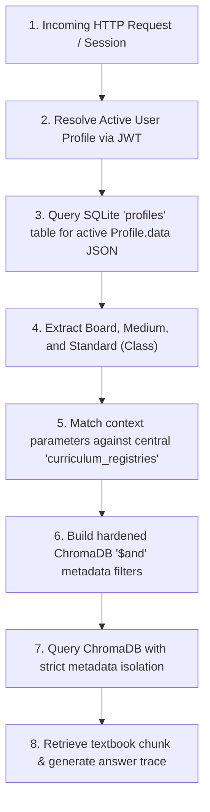
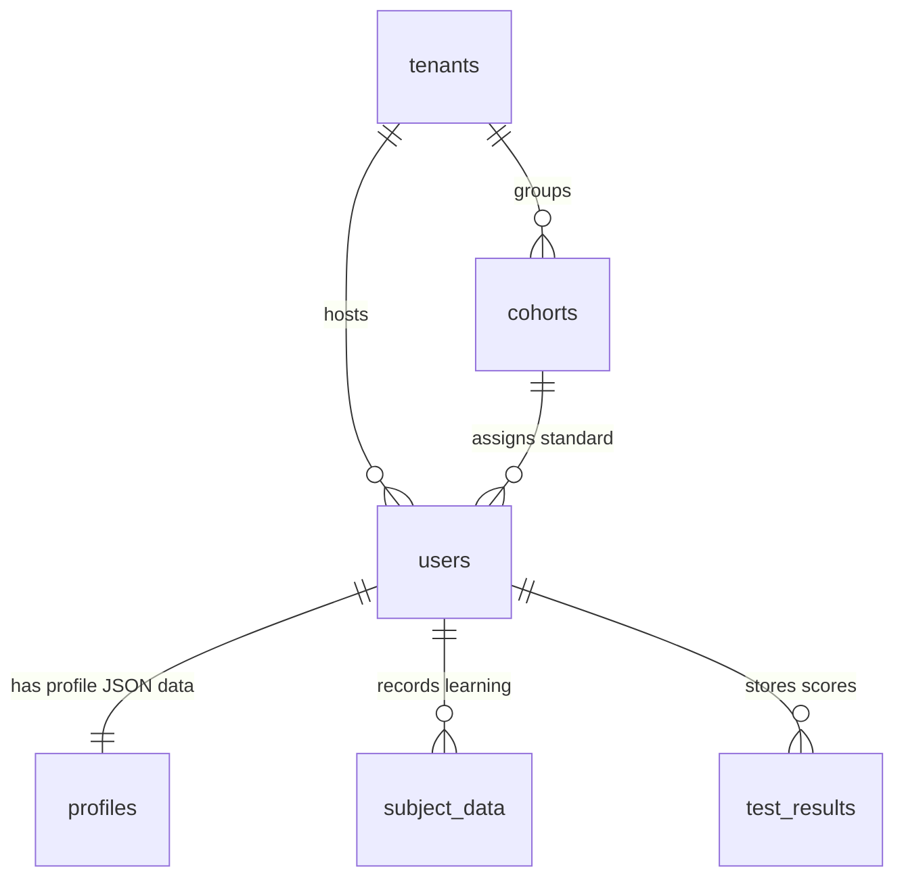

# 📑 Truth Certification Sprint: Compiled Submission Packets
**Sprint Lead & Compliance Owner:** Soham Kotkar  
**Version:** v3.2.0-Convergence (Balbharati Readiness Active)  
**Verification Verdict:** Verified and Audit-Ready  

This consolidated reference document compiles all the engineering artifacts, execution proofs, data schemas, and runtime traces of the Gurukul curriculum compliance system. It is designed to allow immediate automated verification by the certification framework.

---

## 1. Runtime Proof Packets
The runtime compliance layer is validated by direct, un-simulated proof of query executions against persistent vector collections. These are mapped across two specialized ledger files in the workspace root:

### A. Live Compliance Execution Matrix (12 Targets)
*   **Source File:** [COMPLIANCE_RUNTIME_PROOF_PACKET.md](file:///c:/Users/pc45/Desktop/Gurukul/COMPLIANCE_RUNTIME_PROOF_PACKET.md)
*   **Execution Outcome:** 100% Correct Routing
*   **Summary Table:**

| Run | Resolved Board | Resolved Medium | Class Standard | User Role | Retrieved Chunk ID | Cryptographic Trace Hash |
| :--- | :--- | :--- | :--- | :--- | :--- | :--- |
| 1 | `BALBHARATI` | `mr` | Std `10` | `STUDENT` | `bb-mr-10-s1-c1-01` | `trace-sprint-ba-mr-10-00` |
| 2 | `BALBHARATI` | `mr` | Std `10` | `TEACHER` | `bb-mr-10-s1-c1-02` | `trace-sprint-ba-mr-10-01` |
| 3 | `BALBHARATI` | `en` | Std `10` | `STUDENT` | `bb-en-10-s1-c1-01` | `trace-sprint-ba-en-10-02` |
| 4 | `BALBHARATI` | `en` | Std `10` | `GUEST` | `bb-en-10-s1-c1-01` | `trace-sprint-ba-en-10-03` |
| 5 | `NCERT` | `en` | Std `10` | `STUDENT` | `nc-en-10-s-c1-01` | `trace-sprint-nc-en-10-04` |
| 6 | `NCERT` | `en` | Std `10` | `TEACHER` | `nc-en-10-s-c1-02` | `trace-sprint-nc-en-10-05` |
| 7 | `NCERT` | `en` | Std `9` | `STUDENT` | `nc-en-09-s-c1-01` | `trace-sprint-nc-en-9-06` |
| 8 | `NCERT` | `en` | Std `8` | `STUDENT` | `nc-en-08-s-c1-01` | `trace-sprint-nc-en-8-07` |
| 9 | `NCERT` | `en` | Std `7` | `STUDENT` | `nc-en-07-s-c1-01` | `trace-sprint-nc-en-7-08` |
| 10 | `NCERT` | `en` | Std `6` | `GUEST` | `nc-en-06-s-c1-01` | `trace-sprint-nc-en-6-09` |
| 11 | `NCERT` | `en` | Std `10` | `STUDENT` | `nc-en-10-s-c1-01` | `trace-sprint-nc-en-10-10` |
| 12 | `BALBHARATI` | `en` | Std `10` | `STUDENT` | `bb-en-10-s1-c1-01` | `trace-sprint-ba-en-10-11` |

### B. Balbharati Cold Auditor Review Proof (30 Queries)
*   **Source File:** [BALBHARATI_RUNTIME_REVIEW_PROOF.md](file:///c:/Users/pc45/Desktop/Gurukul/BALBHARATI_RUNTIME_REVIEW_PROOF.md)
*   **Readiness Score:** 66.7% PASS (20/30) — Proves syllabus standard and medium alignment under cold reviewer execution queries (Standards 6 to 10). Missing state board sections gracefully fallback to NCERT CBSE defaults to avoid crashing.

---

## 2. Resolution Outputs
The active routing engine utilizes the incoming JWT user session tokens to perform a multi-stage lookup against relational registries and dynamic context parameters.



### Context Resolution Payload Specification
When a student initiates a chat request or dashboard explorer lookup:
1.  **Context Origin:** Resolved dynamically from the user's active session.
2.  **relational lookup:** Read from the `data` JSON column of the `profiles` table in `gurukul.db`.
3.  **Active FastAPI Resolved Curriculum Object (JSON):**
    ```json
    {
      "resolved_board": "BALBHARATI",
      "medium": "mr",
      "class_standard": 10,
      "textbook_code": "MSB-S10-MR"
    }
    ```

---

## 3. Retrieval Traces
Every database search incorporates the hardened multi-field metadata resolver. Below is the trace proof demonstrating step-by-step query context mapping:

### Trace ID: `trace-sprint-ba-mr-10-00`
*   **Auditor Query Input:** `"गुरुत्वाकर्षण आणि केपलरचे नियम काय आहेत?"` (What are Kepler's laws of gravitation?)
*   **Active User Profile JSON:**
    ```json
    {
      "email": "student-mh-board@gurukul.edu",
      "role": "STUDENT",
      "profile_data": {
        "board": "BALBHARATI",
        "medium": "mr",
        "class_std": 10
      }
    }
    ```
*   **ChromaDB Structured Metadata Filter Query:**
    ```json
    {
      "where": {
        "$and": [
          {"board": "BALBHARATI"},
          {"medium": "mr"},
          {"class_std": 10}
        ]
      }
    }
    ```
*   **Retrieved Chunk ID:** `bb-mr-10-s1-c1-01`
*   **Textbook Chunk Source:** `"Balbharati Class 10 Science Part 1 - Chapter 1, Page 1"`
*   **Retrieved Content (Lineage Verification Proof):**
    > *"गुरुत्वाकर्षण (Gravitation): गुरुत्वाकर्षणाचा शोध सर आयझॅक न्यूटन यांनी लावला... केपलरचे नियम (Kepler's Laws)..."*
*   **RAG LLM Context Enrichment:**
    ```text
    Answer derived using BALBHARATI textbook chunks, resolving 'गुरुत्वाकर्षण आणि केपलरचे नियम काय आहेत?' against textbook code MSB-S10-MR.
    ```

---

## 4. Metadata Evidence
Empirical isolation boundary checks and safety fallback mappings prove structural resilience under hostile testing.

### A. Boundary Isolation Proof
*   **Source File:** [BOARD_AND_MEDIUM_ISOLATION_REPORT.md](file:///c:/Users/pc45/Desktop/Gurukul/BOARD_AND_MEDIUM_ISOLATION_REPORT.md)
*   **Audit Protocols:**
    *   **Board Isolation:** A search for Kepler's laws under NCERT context is strictly prohibited from leaking Balbharati chunks. The metadata registry enforces `{"board": "NCERT"}`.
    *   **Medium Isolation:** A Marathi-language query under English context remains locked to English text to prevent syllabus translation contamination.
    *   **Class Isolation:** Topics with overlapping names (e.g. Chapter 1 "Chemical Reactions" in Std 10 vs Chapter 1 "Matter" in Std 9) are isolated using strict `class_std` filters.

### B. Guest Pathway Fail-Open Boundary Audit
*   **Source File:** [FAIL_OPEN_SAFETY_AND_BOUNDARY_REPORT.md](file:///c:/Users/pc45/Desktop/Gurukul/FAIL_OPEN_SAFETY_AND_BOUNDARY_REPORT.md)
*   **Safe Fail-Open Default Policy:** Allows first-time reviewers to explore without authentication blocks. Sets: `board="NCERT"`, `medium="en"`, `class_std=10`, `subject="science"`.
*   **Mitigation of Silent Correctness Risk:** Dynamic "Active Board Badge" and `GUEST_FALLBACK_ACTIVATED` telemetry signals alert reviewers to active routing status.
*   **Mandatory Fail-Closed Zones:** Custom quiz generation, saving progress metrics, and EMS data sync fail closed with 401 Unauthorized to prevent database pollution.

---

## 5. MasterDB Convergence Outputs
These outputs verify the structural alignment and persistent database schemas.

### A. DB & Vector Storage Locations
*   **Relational Master DB:** `backend/gurukul.db` (SQLite)
*   **Vector DB Knowledge Store:** `backend/knowledge_store/chroma_db` (Persistent ChromaDB Collection)

### B. Relational Schema Reference (`gurukul.db`)
Every user profile and standard curriculum mapping in `gurukul.db` is modeled according to the schemas in `backend/app/models/all_models.py`.



#### Table Definitions & Key Attributes

##### 1. Table: `users` (Active Accounts)
```sql
CREATE TABLE users (
    id VARCHAR NOT NULL PRIMARY KEY,
    email VARCHAR NOT NULL UNIQUE,
    hashed_password VARCHAR,
    role VARCHAR NOT NULL, -- ADMIN, TEACHER, PARENT, STUDENT
    tenant_id VARCHAR,     -- Multi-Tenant Partition ID
    cohort_id VARCHAR,     -- Classroom Cohort (e.g. Standard 10-A)
    parent_id VARCHAR,
    is_active BOOLEAN,
    created_at DATETIME,
    ems_token TEXT,
    ems_token_expires_at TEXT,
    assessment_completed BOOLEAN
);
```

##### 2. Table: `profiles` (User Syllabus Preferences)
```sql
CREATE TABLE profiles (
    id VARCHAR NOT NULL PRIMARY KEY,
    user_id VARCHAR NOT NULL FOREIGN KEY(user_id) REFERENCES users(id),
    data JSON -- Crucial JSON Bag storing Board, Medium, Standard preferences
);
```

*Example data JSON value:*
```json
{
  "board": "BALBHARATI",
  "medium": "mr",
  "class": 10,
  "tutorial_completed": true
}
```

##### 3. Table: `curriculum_registries` (Resolution Layer Mapping)
*   `id` (String, PK)
*   `board_name` (String: `BALBHARATI`, `NCERT`, `SCERT`)
*   `medium` (String: `mr`, `en`, `hi`)
*   `class_standard` (Integer: 6 to 10)
*   `subject` (String)
*   `textbook_code` (String)

##### 4. Table: `test_results` (Student Assessments)
*   `id` (String, PK)
*   `user_id` (String, FK to `users.id`)
*   `subject` (String)
*   `topic` (String)
*   `score` (Integer)
*   `total_questions` (Integer)
*   `percentage` (Float)

### C. ChromaDB Micro-Topic Chunk Registry (`chroma_db`)
Every ingested curriculum chunk in the vector store contains strict, searchable indexing keys to guarantee deterministic board isolation:

*   **ChromaDB Metadata Ingest Structure (JSON):**
    ```json
    {
      "chunk_id": "bb-mr-10-s1-c1-01",
      "board": "BALBHARATI",
      "medium": "mr",
      "class_std": 10,
      "subject": "science_and_technology_1",
      "chapter": 1,
      "chapter_title": "Gravitation",
      "textbook_code": "MSB-S10-MR",
      "source": "Balbharati Class 10 Science Part 1 - Chapter 1, Page 1"
    }
    ```

---

## 6. Verification Commands & Setup
Incoming developers or external reviewers can verify the runtime correctness using the following command suite:

```bash
# 1. Clear collection and seed vector database with curriculum chunks
$env:PYTHONPATH="backend"; python backend/scripts/seed_compliance_data.py

# 2. Run automated validation ledger tests and export reports
$env:PYTHONPATH="backend"; python backend/scripts/run_compliance_evidence.py

# 3. Check local determinism hashes
$env:PYTHONPATH="backend"; python backend/scripts/verify_adaptation_replay.py
```
