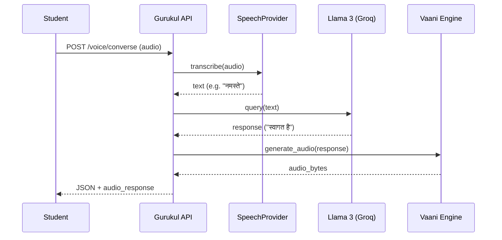

## Overview

The Gurukul Speech Interface Layer adds full multilingual Speech-to-Text (STT) capability, completing the voice conversation loop:


---

## Architecture




---

## Files Added

| File | Description |
|---|---|
| `backend/app/services/stt_service.py` | Core transcription engine (Groq + faster-whisper) |
| `backend/app/services/speech_provider.py` | Production interface with guardrails and caching |
| `backend/app/routers/voice.py` | FastAPI router exposing STT endpoints |

---

## Supported Languages

| Code | Language |
|---|---|
| `en` | English |
| `hi` | Hindi |
| `ar` | Arabic |
| `es` | Spanish |
| `fr` | French |
| `ja` | Japanese |
| `auto` | Auto-detect |

---

## API Endpoints

### `POST /api/v1/voice/listen`
Transcribe an audio file to text.

**Request** (multipart form): 
- `audio`: Audio file (WAV/MP3/OGG/WebM/M4A)
- `language`: Language code or `auto`

**Response**:
```json
{
  "success": true,
  "transcript": "मुझे गणित समझाइए",
  "language": "hi",
  "language_name": "Hindi",
  "confidence": 0.95,
  "engine": "groq",
  "transcription_time_ms": 843.12,
  "word_count": 3
}
```

---

### `POST /api/v1/voice/converse`
Full voice conversation loop.

**Request** (multipart form):
- `audio`: Audio file
- `language`: Language code or `auto`
- `return_audio`: `true` to get TTS response back as base64

**Response**:
```json
{
  "success": true,
  "stt": { "transcript": "...", "language": "hi", "confidence": 0.95 },
  "ai_response": "गणित एक ऐसा विषय है...",
  "audio_response": "<base64-encoded WAV>"
}
```

---

### `GET /api/v1/voice/stt/status`
STT provider health and stats.

### `GET /api/v1/voice/languages`
List of all supported languages.

---

## Configuration

Set these in your `.env` file:

```env
GROQ_API_KEY=gsk_...             # Required for Groq Whisper (primary)
WHISPER_MODEL_SIZE=base          # Optional: tiny|base|small|medium|large (fallback)
```

---

## How to Run

Startup is automatic — the voice router registers itself at backend startup. No additional processes are required.

To test manually:
```bash
curl -X POST http://localhost:3000/api/v1/voice/listen \
  -F "audio=@sample_hindi.wav" \
  -F "language=hi"
```

---

## How to Test

### 1. Verification Suite
Runs mocked unit tests covering logic and guardrails:
```bash
cd Gurukul/backend
python scripts/stt_test.py
```

### 2. Live Log Generator
To get the mandatory **Multilingual Test Logs**, use the provided generator script. 
1. Place audio samples in `backend/scripts/samples/` named `sample_en.wav`, `sample_hi.wav`, etc.
2. Ensure the backend is running.
3. Run the generator:
```bash
python scripts/stt_live_logger.py
```
This will create a `multilingual_test_logs.json` file on success.

---

*Prepared by Soham Kotkar — Speech Interface Layer*
