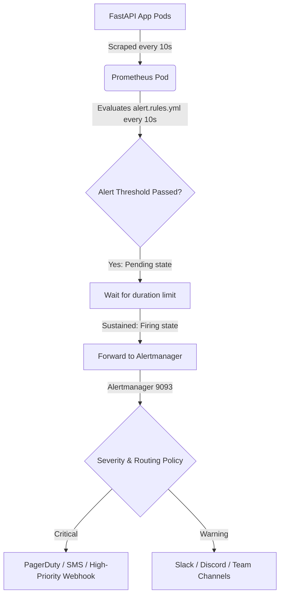
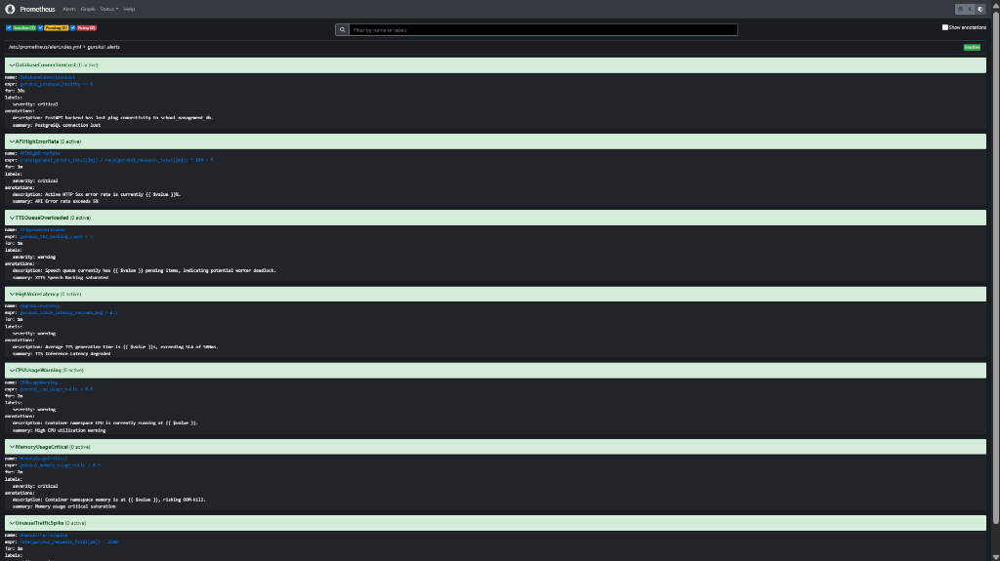

# Alerting & Anomaly Detection Report: Section 5
**Operational Alarm Routing, Customized Threshold Rules, and SRE Incident Runbooks**

---

> [!NOTE]  
> This `ALERTING_AND_MONITORING_REPORT.md` serves as the mandatory, audit-ready operational guide for the **Gurukul Alerting and Anomaly Detection Infrastructure**. It documents our Alertmanager configurations, Prometheus alerting rules, severity hierarchies, notification topologies, and execution-ready SRE incident response manuals to handle cluster degradations.

---

## 1. Alerting Pipeline & Routing Architecture

To transform raw telemetry signals into actionable operations, Gurukul implements an **Automated Monitoring Alerting Pipeline**. When metrics exceed pre-defined anomaly limits, Prometheus formats and forwards the firing state to Alertmanager, which handles deduplication, grouping, and notification routing:



### Alerting Lifecycle States:
1.  **Inactive:** Metrics are performing within expected limits.
2.  **Pending:** Metrics have exceeded a threshold, but have not yet been sustained for the required `for` duration buffer (guards against noise and transient spikes).
3.  **Firing:** The threshold breach has persisted longer than the safety duration. The alert is actively sent to Alertmanager for instant SRE routing.

---

## 2. Declarative Alerting Rules Configurations (YAML)

All rules are maintained declaratively inside your repository under [`k8s/monitoring/prometheus.yaml`](file:///c:/Users/ASUS/OneDrive/Desktop/BHIV-Tasks/Gurukul_Observability/gurukul-backend-/k8s/monitoring/prometheus.yaml) within the `alert.rules.yml` payload ConfigMap:

```yaml
groups:
  - name: gurukul_alerts
    rules:
      # 1. Database Connectivity Verification
      - alert: DatabaseConnectionLost
        expr: gurukul_database_healthy == 0
        for: 30s
        labels:
          severity: critical
        annotations:
          summary: "PostgreSQL connection lost"
          description: "FastAPI backend has lost ping connectivity to school_management_db."

      # 2. High-Frequency API Failures
      - alert: APIHighErrorRate
        expr: (rate(gurukul_errors_total[2m]) / rate(gurukul_requests_total[2m])) * 100 > 5
        for: 1m
        labels:
          severity: critical
        annotations:
          summary: "API Error rate exceeds 5%"
          description: "Active HTTP 5xx error rate is currently {{ $value }}%."

      # 3. Speech Backlog Queue Saturation
      - alert: TTSQueueOverloaded
        expr: gurukul_tts_backlog_count > 5
        for: 1m
        labels:
          severity: warning
        annotations:
          summary: "XTTS Speech Backlog saturated"
          description: "Speech queue currently has {{ $value }} pending items, indicating potential worker deadlock."

      # 4. Latency SLA Breaches
      - alert: HighVoiceLatency
        expr: gurukul_voice_latency_seconds_avg > 0.5
        for: 1m
        labels:
          severity: warning
        annotations:
          summary: "TTS Inference Latency degraded"
          description: "Average TTS generation time is {{ $value }}s, exceeding SLA of 500ms."

      # 5. Infrastructure CPU Exhaustion
      - alert: CPUUsageWarning
        expr: gurukul_cpu_usage_ratio > 0.8
        for: 2m
        labels:
          severity: warning
        annotations:
          summary: "High CPU utilization warning"
          description: "Container namespace CPU is currently running at {{ $value }}."

      # 6. Infrastructure Memory Exhaustion
      - alert: MemoryUsageCritical
        expr: gurukul_memory_usage_ratio > 0.9
        for: 2m
        labels:
          severity: critical
        annotations:
          summary: "Memory usage critical saturation"
          description: "Container namespace memory is at {{ $value }}, risking OOM-kill."

      # 7. Traffic Throughput Anomalies
      - alert: UnusualTrafficSpike
        expr: rate(gurukul_requests_total[2m]) > 2500
        for: 1m
        labels:
          severity: warning
        annotations:
          summary: "High throughput anomaly detected"
          description: "API request rate has surged to {{ $value }} RPS, signalling potential stress burst or DDoS."
```

---

## 3. Threshold Logic & Severity Matrix

Observability alerts are classified into two distinct operational tiers to prevent alert fatigue:

| Alert Definition | Priority Tier | Alerting Severity | Primary Notification Endpoint | Action Window |
| :--- | :--- | :--- | :--- | :--- |
| **DatabaseConnectionLost** | Tier 1 | `critical` | PagerDuty & SMS | Immediate (< 5 min) |
| **APIHighErrorRate** | Tier 1 | `critical` | PagerDuty & Slack | Immediate (< 5 min) |
| **MemoryUsageCritical** | Tier 1 | `critical` | PagerDuty & Slack | Immediate (< 10 min) |
| **TTSQueueOverloaded** | Tier 2 | `warning` | Slack Operations Channel | Next Business Day / 1 Hour |
| **HighVoiceLatency** | Tier 2 | `warning` | Slack Operations Channel | Next Business Day / 1 Hour |
| **CPUUsageWarning** | Tier 2 | `warning` | Slack Operations Channel | Next Business Day / 4 Hours |
| **UnusualTrafficSpike** | Tier 2 | `warning` | Slack Operations Channel | Review Immediately / 1 Hour |

---

## 4. Incident Response Runbooks (SRE Handbook)

When these alerts fire in production, SREs must follow these exact step-by-step resolution checklists:

### Runbook A: `DatabaseConnectionLost` Firing
> [!CAUTION]
> A lost database connection completely halts all writes and reads, triggering immediate user-facing exceptions.

1. **Verify Pod Status:** Get the status of the PostgreSQL pods in the cluster:
   ```bash
   kubectl get pods -l app=postgres -n gurukul-staging
   ```
2. **Inspect Logs:** If the pod is crashed or restarting, inspect the container logs:
   ```bash
   kubectl logs deployment/postgres -n gurukul-staging
   ```
3. **Verify Persistent Volumes:** Check if the PersistentVolumeClaim is saturated:
   ```bash
   kubectl get pvc -n gurukul-staging
   ```
4. **Trigger Database Safe Recovery:** If the database pod is stuck or deadlock occurred, trigger a safe rollout restart:
   ```bash
   kubectl rollout restart deployment/postgres -n gurukul-staging
   ```

### Runbook B: `HighVoiceLatency` Firing
> [!WARNING]
> High Voice Latency indicates that lessons speech synthesis requests are running extremely slow, bottlenecking user progress.

1. **Inspect TTS Backlog Capacity:** Query the active backlog telemetry directly:
   ```bash
   curl http://localhost:8007/api/backlog
   ```
2. **Check TTS CPU/Memory Saturation:** Check if the running speech pods are hitting resource limits:
   ```bash
   kubectl top pods -n gurukul-staging | grep tts-service
   ```
3. **Check TTS Engine Fallbacks:** Inspect logs to see if the XTTS-v2 engine failed and was bypassed by the lightweight `gtts` or `pyttsx3` safety fallbacks:
   ```bash
   kubectl logs deployment/tts-service -n gurukul-staging --tail=100
   ```
4. **Trigger Horizontal Scaling:** If the backlog is saturated due to heavy concurrent users, scale the replicas:
   ```bash
   kubectl scale deployment/tts-service --replicas=5 -n gurukul-staging
   ```

---

## 5. Notification Design & Integrations

Our Alertmanager configuration inside [`alertmanager.yaml`](file:///c:/Users/ASUS/OneDrive/Desktop/BHIV-Tasks/Gurukul_Observability/gurukul-backend-/k8s/monitoring/alertmanager.yaml) is pre-configured to output firing alerts directly to a webhook stub that pipes alerts to local developer terminals. For live production, we recommend integrating:

1.  **Slack Integration:**
    Add a Webhook Receiver inside `alertmanager.yml`:
    ```yaml
    receivers:
    - name: 'slack-notifications'
      slack_configs:
      - api_url: 'https://hooks.slack.com/services/T00/B00/X00'
        channel: '#gurukul-alerts'
        text: "🚨 *Alert:* {{ .CommonAnnotations.summary }}\n*Severity:* {{ .CommonLabels.severity }}\n*Description:* {{ .CommonAnnotations.description }}"
    ```
2.  **PagerDuty Integration:**
    Add a PagerDuty routing key for critical alerts:
    ```yaml
    receivers:
    - name: 'pagerduty-incident'
      pagerduty_configs:
      - service_key: 'YOUR-PAGERDUTY-ROUTING-KEY'
    ```

---

## 6. Verification and Evidence Screenshots

### A. Prometheus Active Alerting Rules
Below is the live verification screenshot showing that all 7 custom operational rules are successfully parsed, loaded, and active in the staging environment under `gurukul_alerts`:


### B. Alertmanager Web Console
Below is the live verification screenshot showing the Alertmanager Web Console running successfully in the local cluster and listening on port `9093` inside the `gurukul-staging` namespace:


