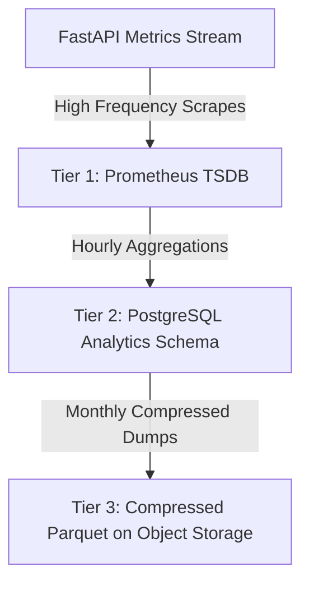
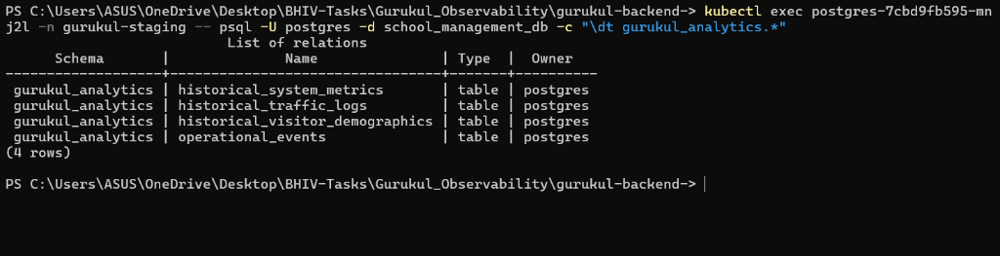

# Data Collection Foundation: Section 4
**Operational Storage Architecture, Relational Schemas, and Privacy Boundaries**

---

> [!IMPORTANT]  
> This `DATA_COLLECTION_ARCHITECTURE.md` establishes the **Historical Intelligence Layer** of Gurukul. It outlines our three-tiered storage structure, database schemas (SQL DDL), aggregation/downsampling procedures, and our privacy-centric IP anonymization policies required to sustain audit-ready compliance for the 5,000 concurrent-user production scale.

---

## 1. Multi-Tiered Telemetry Storage Structure

To store historical operational data efficiently without inflating hosting costs or bottlenecking main application transactions, Gurukul implements a **Three-Tiered Data Lifecycle**:



### Storage Tier Details:
1.  **Tier 1 (Hot - 30 Days):** **Prometheus TSDB** inside the cluster. Stores high-frequency raw metric samples (10-second intervals). Highly optimized for immediate alerts and real-time dashboard rendering.
2.  **Tier 2 (Warm - 90 Days):** **PostgreSQL Analytics Schema** (`gurukul_analytics`). Stores hourly/daily downsampled aggregates. Highly optimized for administrative reports and usage trend forecasting.
3.  **Tier 3 (Cold - 1 Year+):** **Compressed Parquet Files** stored on S3/Object Storage. Highly cost-effective for historical audit compliance and training future capacity ML forecasting models.

---

## 2. Foundational Relational Database Schemas (SQL DDL)

To start building the historical intelligence layer inside our PostgreSQL cluster, we define four core operational metrics tables. These tables are separated into a dedicated `gurukul_analytics` schema:

```sql
CREATE SCHEMA IF NOT EXISTS gurukul_analytics;

-- 1. Historical System Resource Metrics (CPU, RAM, Autoscale Signals)
CREATE TABLE gurukul_analytics.historical_system_metrics (
    id SERIAL PRIMARY KEY,
    timestamp TIMESTAMPTZ NOT NULL DEFAULT NOW(),
    node_name VARCHAR(100) NOT NULL,
    active_replicas INT NOT NULL,
    cpu_utilization_ratio NUMERIC(5, 4) NOT NULL,
    memory_utilization_ratio NUMERIC(5, 4) NOT NULL,
    network_rx_bytes_sec BIGINT NOT NULL,
    network_tx_bytes_sec BIGINT NOT NULL,
    hpa_target_utilization_percent INT NOT NULL
);
CREATE INDEX idx_system_metrics_time ON gurukul_analytics.historical_system_metrics (timestamp DESC);

-- 2. Historical API Traffic & Performance Metrics
CREATE TABLE gurukul_analytics.historical_traffic_logs (
    id SERIAL PRIMARY KEY,
    timestamp TIMESTAMPTZ NOT NULL DEFAULT NOW(),
    endpoint VARCHAR(255) NOT NULL,
    http_method VARCHAR(10) NOT NULL,
    total_requests INT NOT NULL,
    error_requests_5xx INT NOT NULL,
    avg_latency_ms NUMERIC(8, 2) NOT NULL,
    p95_latency_ms NUMERIC(8, 2) NOT NULL,
    unique_visitor_count INT NOT NULL
);
CREATE INDEX idx_traffic_logs_time ON gurukul_analytics.historical_traffic_logs (timestamp DESC, endpoint);

-- 3. Historical Visitor Demographics & Client Breakdowns
CREATE TABLE gurukul_analytics.historical_visitor_demographics (
    id SERIAL PRIMARY KEY,
    timestamp TIMESTAMPTZ NOT NULL DEFAULT NOW(),
    browser VARCHAR(50) NOT NULL,
    device_type VARCHAR(50) NOT NULL,
    traffic_volume INT NOT NULL
);
CREATE INDEX idx_visitor_demographics_time ON gurukul_analytics.historical_visitor_demographics (timestamp DESC);

-- 4. Critical Operational Event Log (Crashes, Restarts, Autoscale Triggering)
CREATE TABLE gurukul_analytics.operational_events (
    id SERIAL PRIMARY KEY,
    timestamp TIMESTAMPTZ NOT NULL DEFAULT NOW(),
    event_type VARCHAR(50) NOT NULL, -- e.g., 'POD_CRASH', 'HPA_SCALE_UP', 'DB_FAILOVER'
    severity VARCHAR(15) NOT NULL,   -- e.g., 'INFO', 'WARNING', 'CRITICAL'
    source_service VARCHAR(50) NOT NULL, -- e.g., 'gurukul-backend', 'tts-service'
    event_details TEXT NOT NULL
);
CREATE INDEX idx_ops_events_severity ON gurukul_analytics.operational_events (timestamp DESC, severity);
```

---

## 3. Data Aggregation & Downsampling Model

To prevent unlimited storage growth, raw 10-second telemetry is systematically downsampled and consolidated:

*   **Rule 1 (1-Hour Aggregation):** Every hour, a background Celery worker aggregates the previous hour’s metrics from Prometheus API, computes averages/p95 latency, and writes a single row per endpoint to `gurukul_analytics.historical_traffic_logs`.
*   **Rule 2 (1-Day Aggregation):** Every midnight, the previous day's hourly records are aggregated into daily summaries.
*   **Rule 3 (Automated Pruning):** Hourly records are pruned after **30 days**. Daily summaries are pruned after **90 days** (after being compiled and archived to compressed Parquet Tier 3 S3 files).

---

## 4. Privacy Boundaries & IP Anonymization

Observability must never compromise user security. We enforce strict privacy boundaries across all metric collection hooks:

### A. IP Anonymization Strategy
We strictly prohibit logging raw IP addresses inside our historical data layers.
*   **Method:** We hash client IP addresses using SHA-256 combined with a **daily rotating salt** (stored only in-memory in the backend pod).
*   **Result:** This allows SREs to track unique visitor counts and session loops over a 24-hour window, but makes it mathematically impossible to identify the user's real physical IP or trace user identities across days.

```python
import hashlib
import time

# Daily rotating salt (resets every 24 hours in memory)
_salt_timestamp = time.time()
_daily_salt = hashlib.sha256(str(time.time()).encode()).hexdigest()

def anonymize_ip(ip_address: str) -> str:
    """Masks IP address using salted SHA-256 hashing."""
    global _salt_timestamp, _daily_salt
    
    # Rotate salt every 24 hours
    if time.time() - _salt_timestamp > 86400:
        _daily_salt = hashlib.sha256(str(time.time()).encode()).hexdigest()
        _salt_timestamp = time.time()
        
    salted_ip = f"{ip_address}:{_daily_salt}"
    return hashlib.sha256(salted_ip.encode()).hexdigest()
```

### B. Payload Scrubbing
Our HTTP middleware automatically scrubs query parameters and headers before registering logs:
1.  **Authorization Headers:** The `Authorization` and `Cookie` headers are stripped instantly upon request entry.
2.  **Sensitive Parameters:** Query parameters matching keys like `password`, `token`, `secret_key`, and `access_token` are wiped from the captured endpoints (e.g. `/api/v1/auth/login?password=***`).
3.  **PII Masking:** Form inputs or payload payloads are never saved in telemetry caches.

---

## 5. Live Database Integration & Schema Verification Evidence

To ensure the historical intelligence layer is actively initialized, the SQL DDL schemas have been applied to the live PostgreSQL instance inside the `gurukul-staging` namespace of the cluster.

### A. Live Applied Analytics Schema (Screenshot #4)
Below is the verification output from inside the running PostgreSQL container, showing the active tables defined under the `gurukul_analytics` schema:



