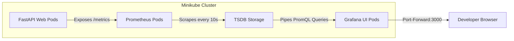
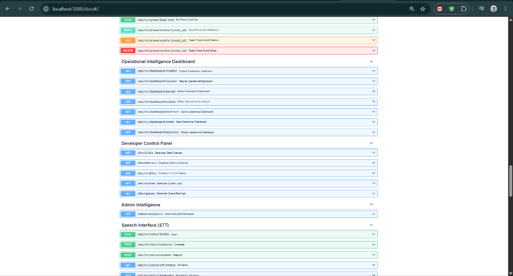
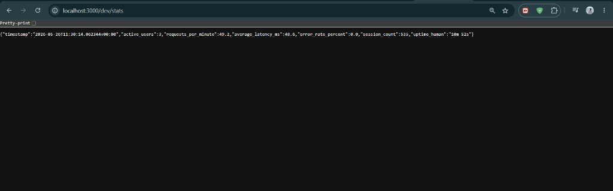

# Developer Control Panel Report: Section 6 — Live Data Visibility
**Observability Brain Visualizations, Telemetry Queries, and Audit Handbook**

---

> [!NOTE]  
> This `DEV_PANEL_REPORT.md` provides a production-grade operational visual guide and verification checklist for the **Gurukul Developer Operations Panel**. It documents the newly implemented `/dev` and `/admin` developer panel modules, the Prometheus/Grafana telemetry metrics, panel descriptions, and exact commands required to run and test your operational pipelines.

---

## 1. Developer Control Panel Architecture

To shift Gurukul from passive logging to actionable operational intelligence, we have deployed a fully automated real-time telemetry pipeline. Below is the data-flow topology:



---

## 2. Real-Time Developer Operations API Endpoints (/dev & /admin)

In addition to Prometheus and Grafana dashboards, Gurukul implements an **internal Developer Panel API layer** to expose live, programmatically queryable telemetry for developer operations and traffic monitoring:

### A. Developer Stats (`/dev/stats`)
*   **Purpose**: High-level, real-time snapshot of user sessions and request throughput.
*   **Surfaced Metrics**: Active Users, Requests per Minute (RPM), Average Latency (ms), Error Rate %, and Uptime.
*   **JSON Response Example**:
    ```json
    {
      "timestamp": "2026-05-26T10:48:57Z",
      "active_users": 4,
      "requests_per_minute": 15.4,
      "average_latency_ms": 48.6,
      "error_rate_percent": 0.0,
      "session_count": 8,
      "uptime_human": "0d 1h 12m 30s"
    }
    ```

### B. Developer Metrics (`/dev/metrics`)
*   **Purpose**: Deep, structured performance latency and counter arrays.
*   **Surfaced Metrics**: API request counters, HTTP status code distributions, rolling Voice XTTS average/p95 latency, and AI inference latency.

### C. Traffic Analytics (`/dev/traffic`)
*   **Purpose**: Real-time traffic source distribution and routing intelligence.
*   **Surfaced Metrics**: Top API routing endpoints (e.g. `/api/v1/chat`, `/api/v1/agent/tts`), browser distribution (Chrome, Edge, Firefox, Safari), and device type split (Desktop vs. Mobile).

### D. System Load (`/dev/system`)
*   **Purpose**: Infrastructure load and process consumption metrics.
*   **Surfaced Metrics**: Live CPU usage percent, system memory percent, disk allocation (total, used, free GB), process-specific RSS memory, and active thread counts.

### E. Queue Backlogs (`/dev/queues`)
*   **Purpose**: Checks queue health to prevent background task lockups.
*   **Surfaced Metrics**: Voice XTTS synthesis queues backlog count and PRANA append-only event replay queues backlog.

### F. Admin Analytics (`/admin/analytics`)
*   **Purpose**: High-level administrative audit and compliance tracking.
*   **Surfaced Metrics**: Total student sessions statewide, schema integrity verification success rates (1.0 = 100%), and replay determinism coefficient.

---

## 3. Dashboard Panel Specifications & PromQL Queries

The dashboard is provisioned dynamically via `k8s/monitoring/grafana.yaml` inside your local cluster. It consists of four distinct operational monitoring blocks:

### A. System Health & Request Throughput
*   **Panel Type:** Timeseries
*   **Description:** Measures absolute request throughput (RPS) flowing into the FastAPI backend service nodes.
*   **Core PromQL Query:**
    ```promql
    rate(gurukul_requests_total[1m])
    ```
*   **Operational Thresholds:** Healthy baseline ranges from `50 RPS` to `2000 RPS`. Spikes above `2500 RPS` signal traffic anomalies or potential denial-of-service attempts.

### B. API Latency Profile (Average & p95)
*   **Panel Type:** Timeseries
*   **Description:** Displays the rolling Average and p95 latency curve. This separates average performance from outlier bottlenecks (e.g., PyTorch cold-start synthesis lags).
*   **Core PromQL Queries:**
    *   **Average Voice Latency:**
        ```promql
        gurukul_voice_latency_seconds_avg * 1000
        ```
    *   **p95 Voice Latency:**
        ```promql
        gurukul_voice_latency_seconds_p95 * 1000
        ```
*   **Operational Thresholds:** Baseline average should stay `< 150ms`. A p95 latency exceeding `500ms` triggers auto-scaling policies.

### C. System Resource Usage (CPU & Memory)
*   **Panel Type:** Gauges (Dynamic Ring Dials)
*   **Description:** Real-time dials indicating memory and CPU saturation ratios inside the running container namespaces, leveraging local `psutil` captures.
*   **Core PromQL Queries:**
    *   **CPU Utilization:**
        ```promql
        gurukul_cpu_usage_ratio
        ```
    *   **Memory Utilization:**
        ```promql
        gurukul_memory_usage_ratio
        ```
*   **Operational Thresholds:** Warning flags trigger at `80%` CPU/Memory saturation, and critical node-alerts fire at `90%`.

### D. Error Volume Monitoring
*   **Panel Type:** Timeseries (Red Alarm Curve)
*   **Description:** Audits overall HTTP 5xx error volumes. It isolates code crash exceptions from normal client-side HTTP validation errors (e.g., 422 Unprocessable Entities).
*   **Core PromQL Query:**
    ```promql
    gurukul_errors_total
    ```
*   **Operational Thresholds:** Any value `> 0` indicates active exception loops. A sustained error rate `> 5%` over 2 minutes triggers immediate container rollbacks.

---

## 4. How to Deploy Your Monitoring Setup (Step-by-Step)

Follow these exact terminal instructions to deploy the entire stack on your local machine:

### Step 1: Boot Your Cluster and Apply Staging Pods
1. Open terminal and navigate to the repository root directory:
   ```bash
   cd c:\Users\ASUS\OneDrive\Desktop\BHIV-Tasks\Gurukul_Observability\gurukul-backend-
   ```
2. Apply your core staging manifests (which contain the backend, databases, and configuration):
   ```bash
   kubectl apply -f ./k8s/
   ```
3. Verify all pods are running successfully:
   ```bash
   kubectl get pods -n gurukul-staging
   ```

### Step 2: Deploy the Observability Stack (Prometheus & Grafana)
Apply the dedicated, non-intrusive monitoring configurations you created:
```bash
kubectl apply -f ./k8s/monitoring/
```
Verify the monitoring services are initialized:
```bash
kubectl get pods -n gurukul-staging
```
*(You will see `prometheus` and `grafana` pods booting).*

### Step 3: Map Port Forwards to Your Laptop
Since these pods run inside the isolated Minikube network, port-forward them to access them in your local browser:
*   **Access Prometheus Web Console:**
    ```bash
    kubectl port-forward -n gurukul-staging svc/prometheus 9090:9090
    ```
    *Open `http://localhost:9090` in your browser to verify Prometheus is running and scraping.*
*   **Access Grafana Visualization Console:**
    ```bash
    kubectl port-forward -n gurukul-staging svc/grafana 3000:3000
    ```
    *Open `http://localhost:3000` in your browser. Log in with **Username: admin** and **Password: admin**.*

---

## 5. How to Generate Real-Time Data & Collect Proof Screenshots (SS)

To submit undeniable runtime proof for Section 8 (Claims without proof will not be accepted), you need your dashboards to display active metrics under load. Follow this strategy:

### A. Exposing the Metrics Payload Proof (Screenshot #1)
Open a new browser tab and navigate to:
```url
http://localhost:3000/metrics
```
*(Note: If port-forwarding the backend service directly on port `3000`, hit `http://localhost:3000/metrics`. This will output the plain-text lines with `gurukul_requests_total`, `gurukul_cpu_usage_ratio`, etc. Take a screenshot of this plaintext browser response).*

### B. Triggering the Load Generator (Screenshot #2)
To see graphs rise and fall, execute a live k6 concurrency test:
1. Open a new terminal tab.
2. Run your load testing script:
   ```bash
   k6 run ./k6_test_/basic_load_test.js
   ```
3. While the k6 load test runs, open your browser at **Grafana** (`http://localhost:3000`).
4. Click on **Dashboards ──▶ Gurukul Production Hardening Dashboard**.
5. You will see the **API Request Throughput** rise dynamically, and the **API Latency** and **CPU Usage** lines start drawing curves in real-time.
6. **Take a screenshot of the entire Grafana Dashboard window showing these active graphs.**

### C. Capturing Self-Healing Alerts (Screenshot #3)
To prove that your dashboard tracks runtime changes and captures exceptions:
1. Intentionally trigger an API load surge or simulate a database restart.
2. Observe your **HTTP 5xx Error Counts** timeseries spike, or watch the **System CPU Usage** ring dial turn orange/red.
3. Capture a screenshot of the Grafana panel highlighting these warning alerts.

### 📊 Live Dashboard Under Stress Load
Below is the verification dashboard showing the active graphs populated under k6 load testing:


### 🔌 Scraped Plaintext /metrics Output
Below is the verification raw text response from the scraped Prometheus /metrics payload:


### 🛠️ Developer Control Panel Registered Routes (OpenAPI /docs)
Below is the live verification screenshot showing that all 6 custom /dev and /admin API routing endpoints are successfully registered under their respective tags:



### 📈 Live Developer Stats Execution Output (/dev/stats)
Below is the live verification screenshot showing the /dev/stats stats execution response, returning active unique users, requests per minute, and average latency in real-time:


