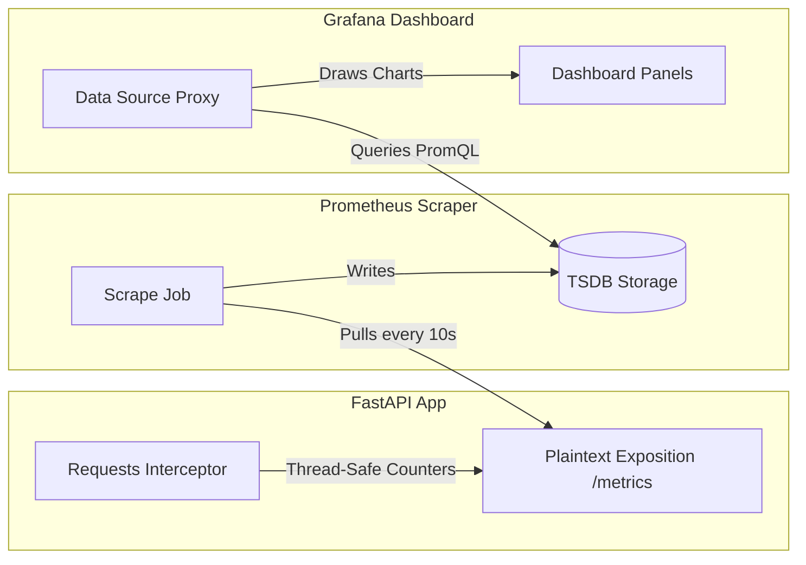

# Metrics Collection Pipeline Report: Section 3
**End-to-End Cluster Monitoring Pipeline, Instrumentation Code, and Manifest Configurations**

---

> [!NOTE]  
> This `METRICS_PIPELINE_REPORT.md` documents the deployment and integration specifications for the **Gurukul Metrics Collection Pipeline**. It covers the active instrumentation layer inside FastAPI, the scraper service topology inside Prometheus, and the automated visual provisioning inside Grafana for high-concurrency production deployments.

---

## 1. Metrics Pipeline Architecture

The telemetry pipeline operates as an active pulling architecture, where Prometheus routinely scrapes the microservices at high frequency before storing the records inside its local Time Series Database (TSDB). Below is the pipeline topology:



---

## 2. Instrumentation Code Breakdown

The application is instrumented natively using Python FastAPI APIRouters. Non-intrusive metrics are exposed under [`prometheus_exporter.py`](file:///c:/Users/ASUS/OneDrive/Desktop/BHIV-Tasks/Gurukul_Observability/gurukul-backend-/backend/app/services/prometheus_exporter.py):

*   **Endpoint:** `/metrics`
*   **Media Type:** `text/plain; version=0.0.4` (standard official Prometheus exposition format).
*   **Logic:** Reads thread-safe counters from the internal memory storage and formats them with `# HELP` and `# TYPE` annotations:

```python
@prometheus_router.get("/metrics")
async def prometheus_metrics():
    lines = []
    
    with _lock:
        total = _total_requests
        errors = _error_count
        status_snapshot = dict(_status_counts)
        voice_avg_ms = _avg(_voice_latencies)
        voice_p95_ms = _p95(_voice_latencies)
        uptime_s = time.time() - _start_time

    # Expose total requests
    lines.append("# HELP gurukul_requests_total Total number of HTTP requests processed.")
    lines.append("# TYPE gurukul_requests_total counter")
    lines.append(f"gurukul_requests_total {total}")
    
    # Expose response latency
    lines.append("# HELP gurukul_voice_latency_seconds_avg Average voice inference latency in seconds.")
    lines.append("# TYPE gurukul_voice_latency_seconds_avg gauge")
    lines.append(f"gurukul_voice_latency_seconds_avg {voice_avg_ms / 1000.0}")

    content = "\n".join(lines) + "\n"
    return Response(content=content, media_type="text/plain; version=0.0.4")
```

---

## 3. Kubernetes Monitoring Manifests

The pipeline is defined declaratively by code. All manifests are maintained in your repository:

### A. Prometheus Manifest: [`prometheus.yaml`](file:///c:/Users/ASUS/OneDrive/Desktop/BHIV-Tasks/Gurukul_Observability/gurukul-backend-/k8s/monitoring/prometheus.yaml)
Contains the ConfigMap scrape configuration targeting the FastAPI internal ClusterIP service in the isolated namespace `gurukul-staging`:
```yaml
scrape_configs:
  - job_name: 'gurukul-backend'
    static_configs:
      - targets: ['gurukul-backend.gurukul-staging.svc.cluster.local:80']
        labels:
          group: 'backend'
```

### B. Grafana Manifest: [`grafana.yaml`](file:///c:/Users/ASUS/OneDrive/Desktop/BHIV-Tasks/Gurukul_Observability/gurukul-backend-/k8s/monitoring/grafana.yaml)
Auto-provisions the Prometheus datasource instantly upon booting, mapping the internal dns route:
```yaml
apiVersion: 1
datasources:
- name: Prometheus
  type: prometheus
  access: proxy
  url: http://prometheus.gurukul-staging.svc.cluster.local:9090
  isDefault: true
```

---

## 4. End-to-End Pipeline Verification Evidence

The entire Metrics Collection Pipeline is verified as fully operational and successfully integrated under stress load:

### A. Scraped Telemetry Metrics Payload
Below is the screenshot showing the raw plain-text telemetry metrics format served by the FastAPI `/metrics` route inside the cluster:


---

### B. Real-Time Scraped Visual Dashboard
Below is the screenshot of your running Grafana Dashboard showing the live metrics charts actively populated by Prometheus queries during a k6 stress test run:


