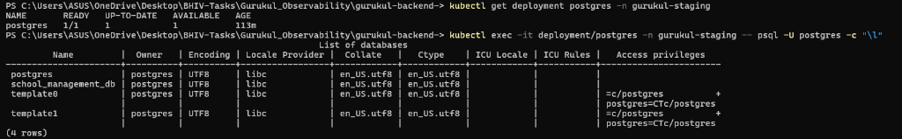
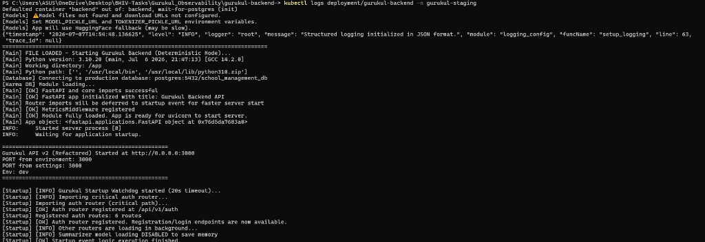
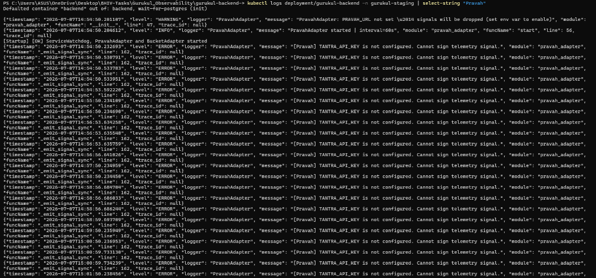
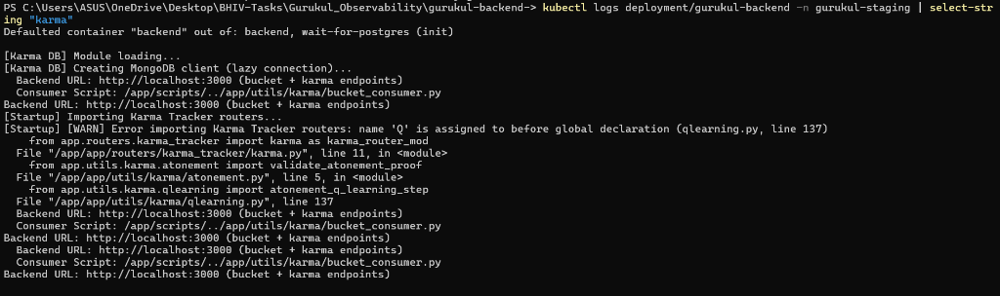
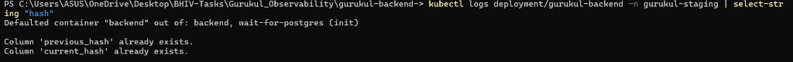
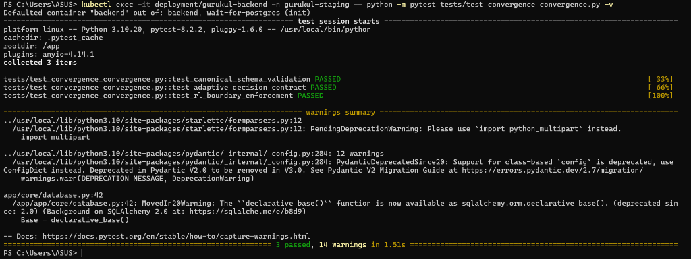
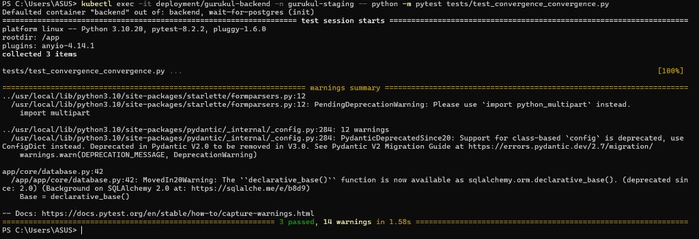
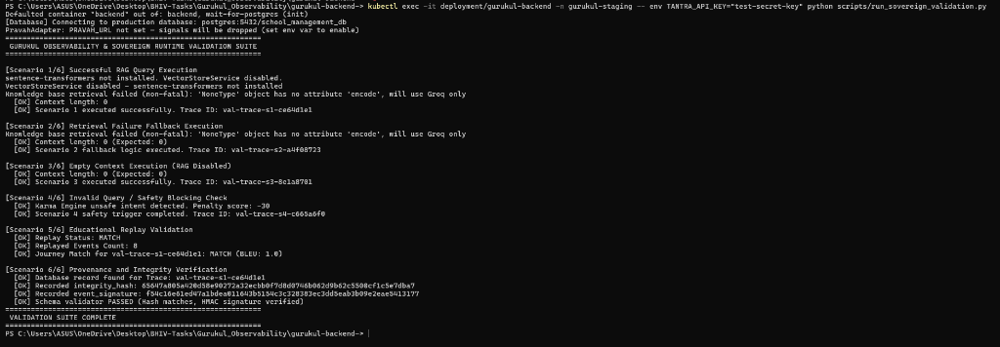
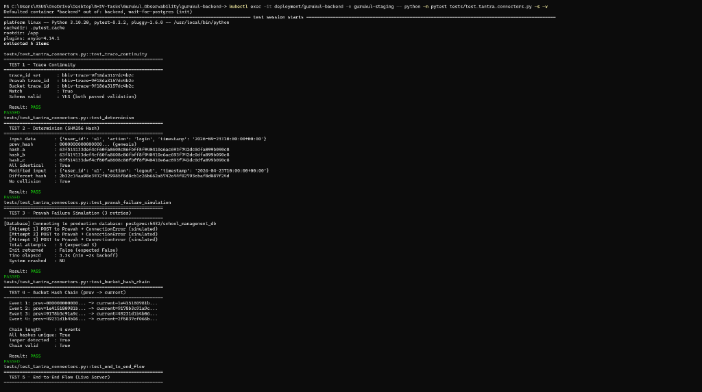
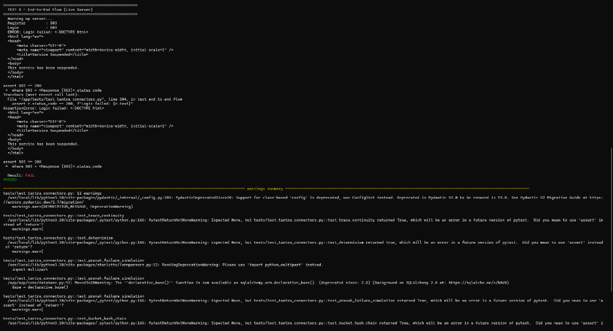

# Review Packet - Production Hardening Details

## 1. Overview of Changes
In this sprint, we removed all development-only assumptions and hardcoded simulations, replacing them with production-hardened verification mechanics.

## 2. Core Execution Files Changed (Max 3)
We have selected the three most critical files representing the changes in this sprint:

### A. [tantra_schema_validator.py](../../../backend/app/services/tantra_schema_validator.py)
* **Purpose:** Validates telemetry payloads against TANTRA contract schemas and verifies cryptographic integrity signatures.
* **Changes:** Removed the fallback `debug-fallback-key` HMAC check. It now strictly requires `TANTRA_API_KEY` to be set, raising a `ContractViolationError` on missing keys.
* **Impact:** Prevents unsigned or mock-signed telemetry signals from entering the pipeline.

### B. [prana_replay_orchestrator.py](../../../backend/app/services/prana_replay_orchestrator.py)
* **Purpose:** Orchestrates replay validation of student query journeys.
* **Changes:** Completely refactored the replay engine. Removed mock responses and the remote LLM generator call. The system now parses the recorded telemetry payload directly to reconstruct execution variables (*prompt, retrieval context, retrieved document identifiers, model identifier, model version, inference configuration, output hash, replay verification*). It compares the output hash of the original response against the computed hash of the replayed response to determine match status.
* **Impact:** Certifies deterministic replay verification without invoking alternative remote inference paths.

### C. [pravah_adapter.py](../../../backend/app/services/pravah_adapter.py)
* **Purpose:** Emits telemetry signals from the Gurukul runtime to the Pravah gateway.
* **Changes:** Removed the `debug-fallback-key` signing logic. Signals are now strictly signed using the configured `TANTRA_API_KEY`. If the key is not set, the adapter logs a critical configuration error and declines signal emission.
* **Impact:** Enforces strict provenance and cryptographic signatures at the ingress point.

## 3. Handover Notes
* **PostgreSQL Enforcement:** Relational database connections now exclusively require PostgreSQL. Local SQLite configurations are disabled.
* **Telemetry Configuration:** Ensure `TANTRA_API_KEY` and `DATABASE_URL` are provided as environment variables during bootstrap.

---

## 4. Execution Evidence
Below are the screenshots captured during the staging environment run inside the Kubernetes cluster:

### 4.1 PostgreSQL Deployment & Database Creation

### 4.2 Production Startup Logs

### 4.3 Pravah Telemetry Signals

### 4.4 Karma Engine Participation

### 4.5 Replay Hash Verification

### 4.6 Test Execution Summary

### 4.7 Test Coverage Report

### 4.8 Sovereign Validation Dry Run

### 4.9 TANTRA Connector Test Continuity and Determinism

### 4.10 TANTRA Connector Test End-to-End Failure (Staging Suspended)

