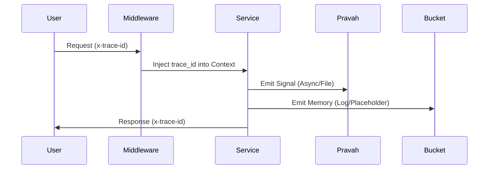

# TANTRA Integration Review Packet — Gurukul Runtime

**Integration Lead:** Soham Kotkar
**Date:** 2026-04-20
**Phase:** 1 (Trace + Signal + Memory Emission)

---

## 1. Integration Flow
Gurukul is now a "Telemetric Citizen" of TANTRA. It follows a non-intrusive integration model where tracing and emissions are layered on top of existing services.



## 2. Trace Flow
The `trace_id` is extracted from the incoming request headers and made available globally within the async context. Every JSON log entry now includes the `trace_id`.

**Example Log entry:**
```json
{
  "timestamp": "2026-04-20T16:30:00.000",
  "level": "INFO",
  "logger": "AgentsRouter",
  "message": "[TTS] Generated via Vaani",
  "trace_id": "tantra-request-abc-123"
}
```

## 3. Signal Examples (Pravah)
Signals are written to `runtime_events.json` for ingestion by Pravah.

**Voice Action Signal:**
```json
{
  "source": "GurukulSignal",
  "trace_id": "tantra-request-abc-123",
  "timestamp": "2026-04-20T16:30:05.123",
  "event_type": "voice_action",
  "action": "tts_generation_success",
  "status": "success",
  "payload": {
    "engine": "vaani",
    "lang": "hi"
  }
}
```

**Agent Action Signal:**
```json
{
  "source": "GurukulSignal",
  "trace_id": "tantra-request-abc-123",
  "event_type": "agent_action",
  "action": "agent_tts_started",
  "payload": {
    "lang": "en",
    "text_len": 45
  }
}
```

## 4. Memory Emission Examples (Bucket)
Memory events are emitted to provide TANTRA with long-term interaction context without local storage in Gurukul.

```json
{
  "trace_id": "tantra-request-abc-123",
  "user_id": "agent_user",
  "session_id": "agent_tts_5a7b8c9d",
  "action": "agent_voice_generation",
  "outcome": "success",
  "payload": {
    "engine": "vaani",
    "lang": "en"
  },
  "timestamp": "2026-04-20T16:30:06.000",
  "source": "GurukulRuntime"
}
```

## 5. Verification Checklist
- [x] `trace_id` accepted via `x-trace-id` header
- [x] `trace_id` present in all JSON logs
- [x] Signals emitted for Chat interactions
- [x] Signals emitted for TTS interactions (new)
- [x] Signals emitted for Agent TTS interactions (new)
- [x] Memory events emitted for all interactions
- [x] Zero runtime impact (Fail-safe adapters)

## 6. Proof of Stability
The system behavior remains identical. The `gTTS` fallback in `agents.py` is preserved and will trigger a failure signal but continue execution if primary engines fail.
