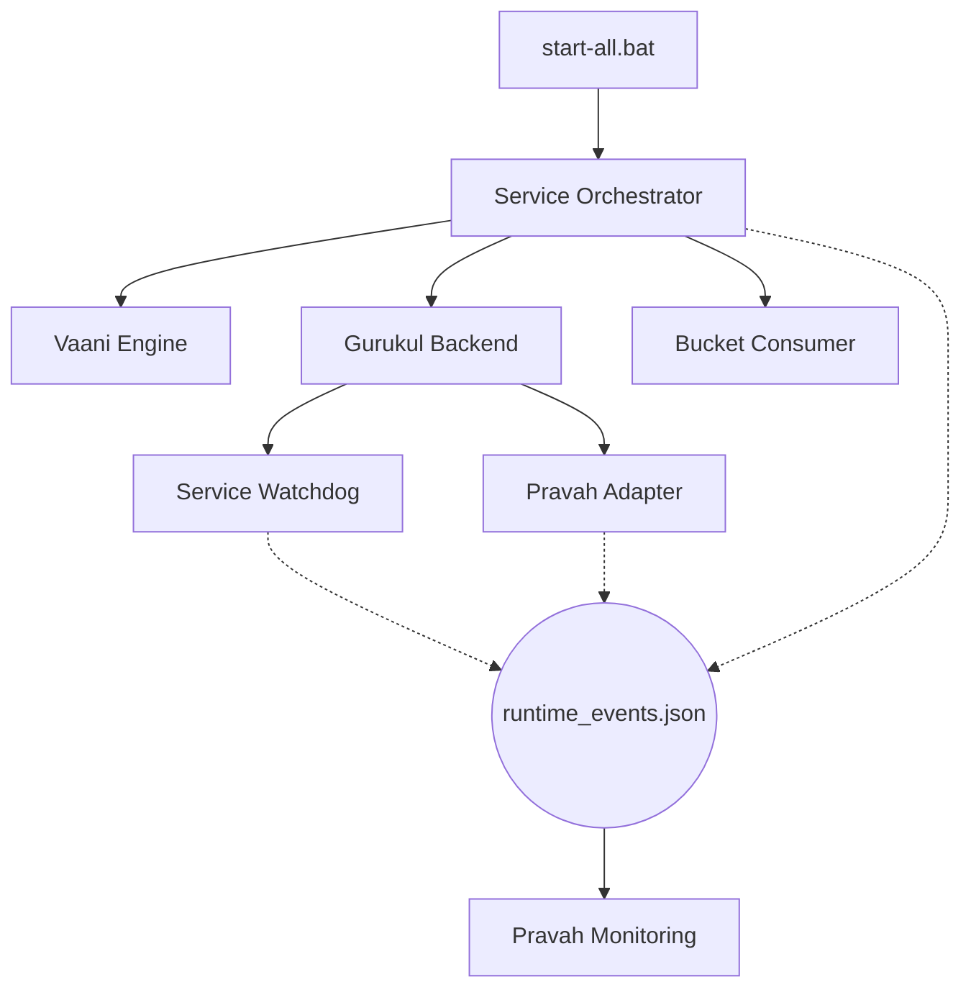

# Gurukul Deterministic Runtime

This directory contains the core orchestration and monitoring logic that ensures Gurukul is a production-ready, observable, and self-healing system.

## Core Principles

1.  **Deterministic Voice Pipeline**: Standardized on **Vaani Engine**. All non-deterministic fallbacks (gTTS, pyttsx3) have been removed. If Vaani is unreachable, the system propagates a clean failure instead of silent fallback.
2.  **Unifed Monitoring**: Observability is split into two distinct tiers:
    - `/system/health`: Ultra-lightweight liveness check (status, service name, uptime).
    - `/system/metrics`: Heavy telemetry including latency rolling averages, request counts, resource usage (CPU/GPU/Disk), and watchdog state.
3.  **Safety-First Watchdog**: 
    - **ServiceOrchestrator** (Scripts): Primary process supervisor for hard restarts.
    - **ServiceWatchdog** (FastAPI Thread): Secondary health observer and soft-reset coordinator (DB connection recycling).
    - **Safety Limits**: Max 3 restarts within a window with a 120s cooldown to prevent infinite crash loops.
4.  **External Observability (Pravah)**: 
    - All runtime events (restarts, heartbeats, failures) are logged to `runtime_events.json` in structured JSON.
    - Standardized application logging via `app/core/logging_config.py` in JSON format.

## Architecture



## Running the System

To launch the system in its hardened state, use the supervised launcher:
```powershell
.\start-all.bat
# Choose [1] Supervised Mode
```

## Monitoring Endpoints

- **Heartbeat**: `http://localhost:3000/system/health`
- **Telemetry**: `http://localhost:3000/system/metrics`
- **Events**: View `runtime_events.json` in the root directory.
