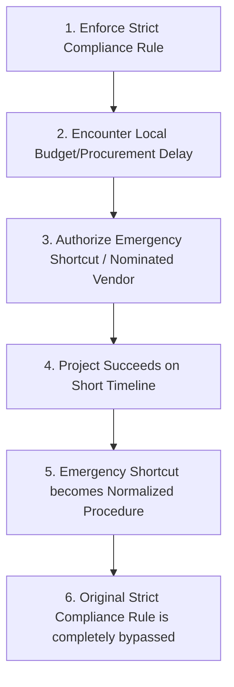

# 📊 Second-Order Risk Analysis
**Phase 4: Systemic Deployment Pressure & Risk Assessment**  
**Audit Lead:** Soham Kotkar — Sprint Lead & Compliance Owner  
**System Status:** TANTRA-Hardened (Operator-Grade)  

This report provides a deep, rigorous second-order risk analysis of the Gurukul educational intelligence platform under real-world deployment conditions. Rather than looking at isolated features, this document analyzes the systemic, organizational, and technical pressures that develop when deploying structured platforms inside complex state governance systems.

---

## ⚖️ 1. Boundary Fatigue (Institutional Overload Risk)

When digital platforms implement too many registries, complex approval gates, and rigorous data interfaces, the organization suffers from **Boundary Fatigue**. Rather than improving security, excessive complexity causes users to develop coping mechanisms that compromise the system.

### Boundary Fatigue Risk Matrix:

| Fatigue Vector | Root Cause | Symptom | Risk Level | Mitigation |
| :--- | :--- | :--- | :--- | :--- |
| **Too Many Registries** | Structuring every minor operational parameter into discrete JSON files. | Technical teams bypass registries by hardcoding values in staging branches. | **Medium-High** | Consolidated registries with automated verification scripts (`validate_registries.py`). |
| **Approval Overload** | Requiring multiple administrative sign-offs (e.g. standard 10 syllabus edits require MSCERT + Balbharati + BEO sign-off). | Approvers rubber-stamp submissions without reviewing them to clear backlogs. | **High** | Implement tiered, automated validation gates that only escalate anomalies. |
| **Interface Fragmentation** | Requiring teachers to use separate apps for telemetry, student profiling, and quiz reviews. | Active field abandonment. Teachers stop using the platform and return to paper logs. | **Extremely High** | Consolidate actions into unified, low-scope MVP control panels (Student, Teacher, School). |

---

## 🕸️ 2. Hidden Recentralization Pressure (Platform Drift)

Sovereign school education is decentralized by design (Concurrent List, local school committees). However, when massive digital platforms (like DIKSHA-scale architectures) are deployed, they introduce a strong **Hidden Recentralization Pressure** that centralizes authority under the guise of technical efficiency.

### Recentralization Dynamics:
*   **The Single-Pane Illusion:** Administrative leaders demand a "single-pane-of-glass" dashboard showing all student and teacher metrics nationwide. This forces state boards to surrender their data sovereignty to the central hosting agency.
*   **Deployment Tooling Monopoly:** Because the technical partner (the SI vendor) operates the state cloud server, they become the de-facto gatekeeper of what curriculum chunks are ingested, quietly bypassing the academic authority of MSCERT.
*   **Master-Platform Drift:** Over time, the centralized platform's schema rules (e.g., TANTRA MDU standards) force local regional school systems to abandon their unique grading and pacing methods, leading to structural homogenization.

---

## 🛠️ 3. Exception Normalization (Operational Bypass Ledger)

In high-pressure bureaucratic environments, strict rule boundaries are frequently bypassed using "temporary emergency shortcuts." Over time, these shortcuts become the **normalized** way of doing business, creating massive compliance gaps.

### Active Exception Vectors in Educational Deployments:
1.  **Pilot Bypasses:** Technical providers deploy uncertified AI models by labeling them as "short-term research pilots" to bypass strict statutory certifications under AI Policy guidelines.
2.  **Committee Shortcuts:** IAS officers bypass lengthy syllabus approval committees by issuing "administrative directives" to Balbharati to print temporary course guidelines.
3.  **Manual Override Normalization:** When the self-healing Watchdog triggers alert notifications due to backend thread locks, local system admins repeatedly press "Reset Watchdog" rather than fixing the underlying database connection pool issues.

---

## 🗣️ 4. Terminology Collision Map (Semantic Ambiguity)

Operational failures often occur because different institutional systems define key terms in fundamentally conflicting ways. When these systems are merged into a single platform, the semantic ambiguity creates severe friction.

### Terminology Collision Map:

| Term | Relational Database Definition (`gurukul.db`) | Vector Store Definition (`chroma_db`) | Administrative Policy Definition (NEP / MSCERT) | Collision Risk & Operational Consequence |
| :--- | :--- | :--- | :--- | :--- |
| **`truth`** | The state of relational rows that successfully pass database constraint checks. | Grounded, un-hallucinated vector chunks with exact print textbook citations. | Authoritative guidelines issued under government seal. | **High.** Developers claim the system is "100% truth compliant" because it doesn't crash, while policy evaluators find actual syllabus omissions. |
| **`compliance`** | Successful JWT payload schema validation under TANTRA criteria. | Strict metadata boundaries that prevent cross-board CBSE RAG leaks. | Adherence to physical government resolution (GR) decrees. | **Extremely High.** A system integrator claims full compliance because tests are green, while the school lacks working tablets. |
| **`ownership`** | The database column mapping who created the SQL row. | The source textbook code (e.g. `MSB-S10-MR`). | The statutory legal authority to define curriculum content. | **Medium-High.** System integrators assume they own the anonymized student data, while state departments assert sovereign data rights. |
| **`AI readiness`** | whisper-large-v3 transcription accuracy and low-latency API response bounds. | Vector collections containing complete textbook chapter splits. | Schools having active computer labs and teachers trained in AI logic. | **High.** High-level dashboards claim "98% AI readiness," while local schools lack stable electricity to power the smart boards. |

---

## 🧲 5. Institutional Gravity

**Institutional Gravity** is the systemic pull exerted by central administrative offices to pull all decentralized educational systems into a single centralized orbit. 

### Gravity Mapping:
*   *Where Pressure Exists Today:* In centralized teacher evaluation portals, unified student assessment systems (PARAKH), and central cloud database sync mandates.
*   *The Operational Friction:* Decentralized local schools function under extremely varied resources. Forcing them to adhere to a centralized, high-throughput digital orbit causes high error rates, manual overrides, and eventual field abandonment. System design must actively resist this gravity by deploying **edge-safe, localized databases** and autonomous local school nodes.

---
*Signed for release,*  
**Soham Kotkar**  
*Lead Compliance Auditor, Gurukul*
